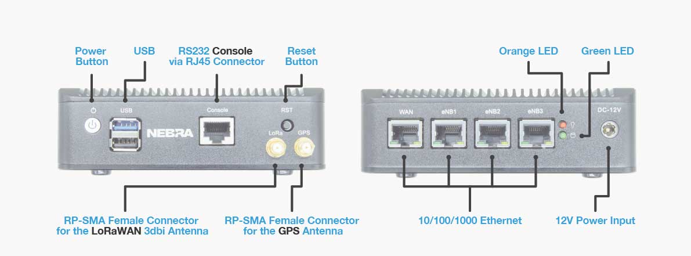
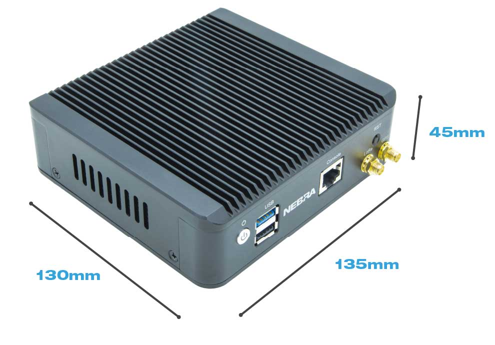

# 5G Indoor Helium Hotspot Overview

Introducing the Nebra 5G Gateway capable of supplying 5G coverage and allowing you to earn Helium (HNT) tokens.

In its current form, the Nebra 5G Gateway utilises LoRa to mine (just like our HNT Indoor & Outdoor miners). However, it’s designed to be modular, meaning you upgrade it to utilise CBRS small cells to earn Helium (HNT). Currently, it’s only feasible to do this in the USA, but we hope to see adoption in the EU and other regions later on down the line.

**Specification listed below is subject to change**

## Features
* Intel J1900 Quad Core 2.4GHz
* 64GB mSATA SSD
* 8GB RAM
* TPM2.0 secure element
* Semtech LoRa built in
* GPS built in
* WiFi 4 / BT 4 built in for setup purposes
* 4 x Gigabit Ethernet
* RS232 Console via RJ45 connector
* 12v 5A power supply (60w max) worldwide adapter provided
* 1 x LoRa antenna
* 1x GPS antenna
* Fanless black aluminium case

## Hardware Specification

| Specification | Nebra 5G Hotspot |
| --- | ---  |
| **Dimensions** | 45x135x130mm (Excluding antenna) |
| **Weight** | TBA |
| **Power Requirement** | 12V 5A |
| **Maximum Tx Power** | TBA |
| **Network Connectivity** | 1Gbit Ethernet, 2.4/5GHz 802.11ac Wi-Fi |
| **Rated Ambient Temperature** | -10 to +50C |
| **Base SoM** | TBA |
| **CPU Specification** | Quad Core 2.4GHz with on-board Wi-Fi and Bluetooth 4 |
| **Storage** | 64GB mSATA SSD (TBC)|
| **Memory** | DDR3L 1333 MHz 8GB (TBC) |

## Operational Feature Specification

| Specification | Nebra 5G Hotspot |
| --- | ---  |
| **NMS** | Feature rich cloud based. NMS provides OAM interface across sites. |
| **Alerting** | Configuring alert rules and external notifications (Slack, Email, web hooks). |
| **Call Tracing** | Native call tracing tools simplifies troubleshooting. |
| **Performance Metrics** | Prometheus/Grafana dashboard for system and network performance monitoring. |

## 3GPP Feature Specification

| --- | ---  |
| **3GPP Release** | 15 for LTE, 15 for 5G SA |
| **4G Core** | MME, SGW, PGW, HSS-Lite |
| **5G Corex** | AMF, SMF, UPF, UDM-Lite |
| **Stateless** | Stateless MME and S-GW allow for hitless service updates/restarts |
| **User plane T-put** | 1Gbps |
| **Connected users** | Up to 600 |
| **QoS control** | 3GPP Standard quality of service class identifier (QCI) |
| **CUPS support** | Native |
| **Handover** | S1 & X2 handover |

## Federation Feature Specification

| --- | ---  |
| **PCRF** | Gx Diameter signalling to external PCRF (Dynamic PCC rule install/remove supported) |
| **S8** | Home routed GTP-U support for external P-GW data path OCS |
| **OCS** | Gy Diameter signalling to external OCS |
| **HSS** | s6a Diameter signalling to external HSS |

## Networking Feature Specification

| --- | ---  |
| **UE NAT** | Support for UE IP allocation via NAT pool |
| **UE Bridge** | Support for UE IP allocation via DHCP proxy from upstream router |
| **UE Static IP** | Support for static IP allocation to UEs based on IMSI and per APN |
| **Multi-APN/SGi** | Configurable mapping of APN to SGi with VLAN tagging |
| **Port forwarding** | Configurable port forwarding when in NAT configuration |
| **Mmt interface** | WAN / SGi interface can be DHCP or static IP allocation with or without VLAN tagging |

## Software Specification

| --- | ---  |
| **OS** | Debian 9.9 (Ubuntu 20.04 coming soon) |
| **Cloud based SW updates** | Major releases quarterly, hot patches monthly |
| **Zero-touch provisioning** | Easy installation |

## Connectors

## Dimensions

