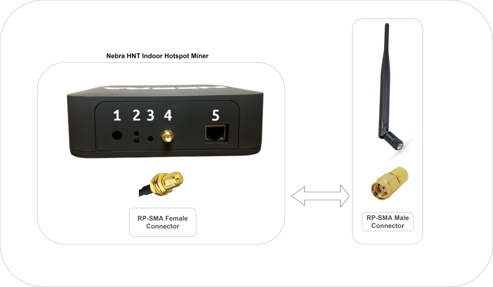
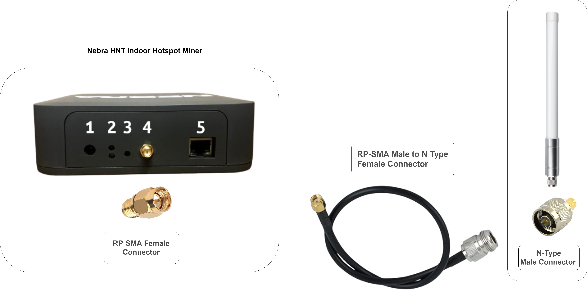
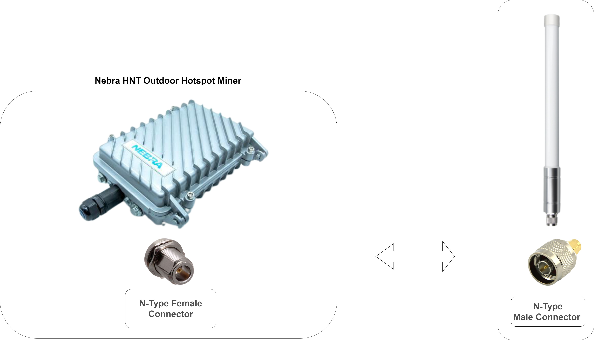
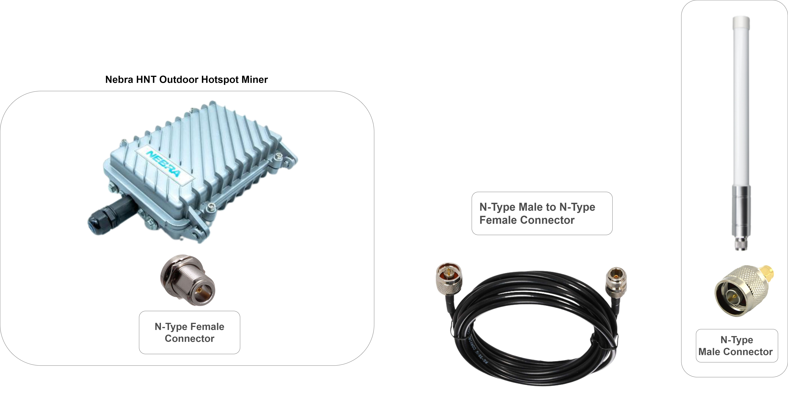

### Contents 

* [Antenna Definitions](../../handy-guides/antenna/overview.md)
* [Antenna Connectors](../../handy-guides/antenna/connectors.md)
* [Antenna Connections](../../handy-guides/antenna/connections.md)

# Indoor Hotspot - RP-SMA Male Antenna Direct Connection 

The Indoor hotspot have **RP-SMA female** connector and the hotspot comes with a 3dBi plastic antenna which has **RP-SMA male** connector. 

# Indoor Hotspot - Glass Fiber Antenna N-Type Connection 

# Indoor Hotspot - Magnetic Base For Antenna Connection 

## 

# Outdoor Hotspot - Glass Fiber Antenna Direct Connection

# Outdoor Hotspot - Glass Fiber Antenna N-Type Connection

