# dashboard

#### Contents

* [Overview](dashboard.md#nebra-hotspot-dashboard)
* [Dashboard Setup](dashboard.md#dashboard-setup)
* [Rewards Section](dashboard.md#rewards-section)
* [Helium Status](dashboard.md#helium-status)
* [Device Details](dashboard.md#device-details)
* [Transfer Device To Another Dashboard](dashboard.md#transfer-device-to-another-dashboard)
* [Remove Device From Current Dashboard](dashboard.md#remove-device-from-current-dashboard)

***

## Nebra Hotspot Dashboard

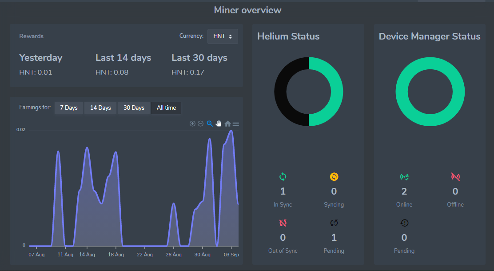

The Nebra Dashboard allows you to view all of your Nebra hotspot statistics in one place: keep track of **rewards**, **sync status**, and **device status**.

### Dashboard Setup

#### Step 1: Create Dashboard Account

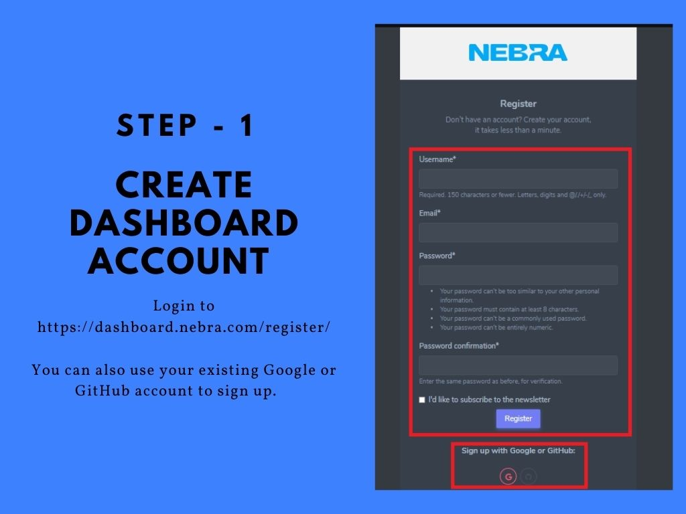

Login to https://dashboard.nebra.com/register/

You can also use your existing Google or GitHub account to sign up.

#### Step 2: Add a device

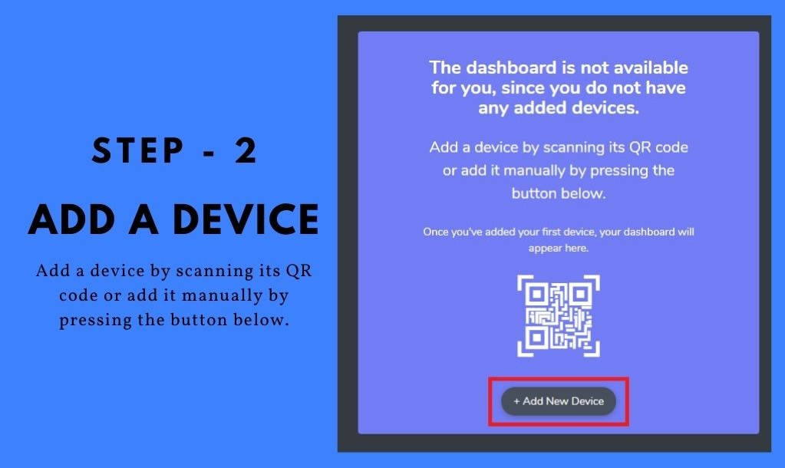

Add a device by scanning its QR code or add it manually by pressing the button below.

#### Step 2.1: Add a device using QR

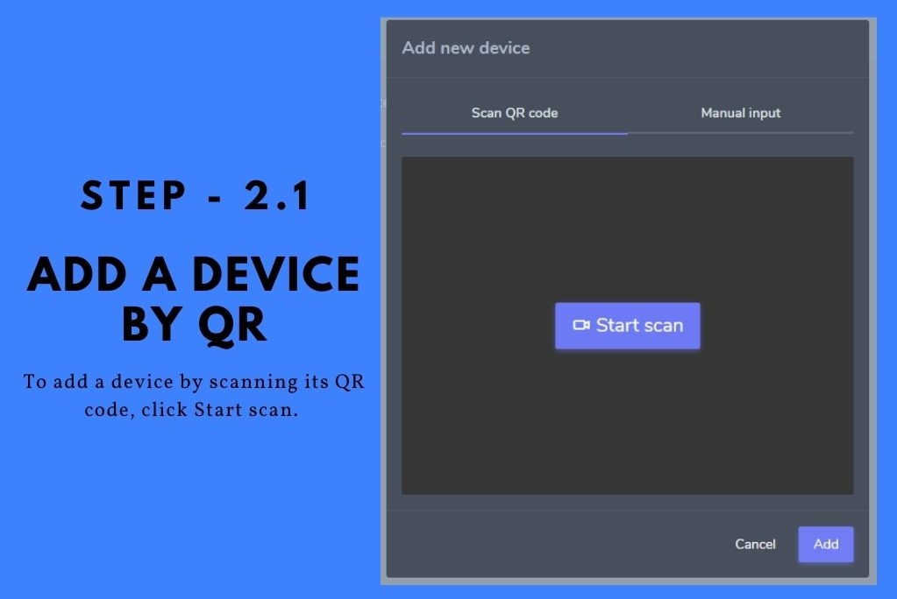 To add a device by scanning its QR code, click Start scan. You will be requested to allow the access to your camera.

### Step 2.2: Add a device by manual input

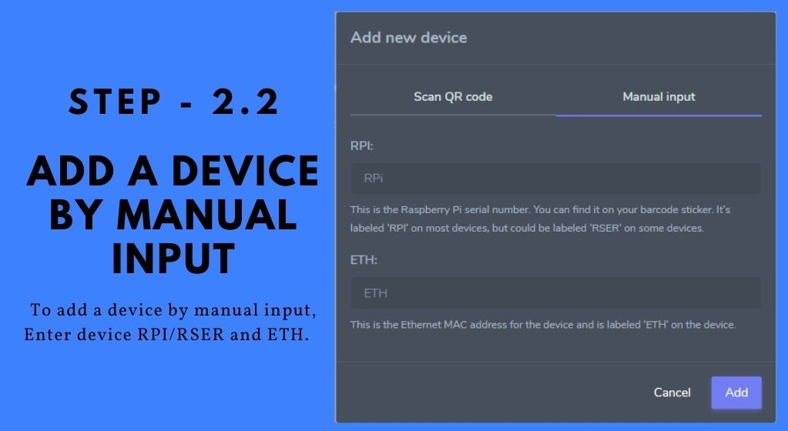

To add a device by manual input, enter the device RPI/RSER and ETH.

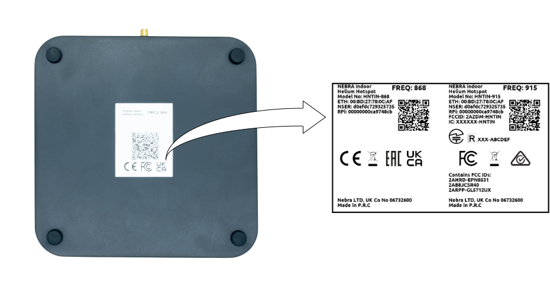

You can can find ETH and RPi/RSER in the device QR Sticker.

* **ETH**: Ethernet MAC address
* **RPi/RSER**: Raspberry Pi Serial Number

#### Step 3: Done: Device Regsiatrtion Completed

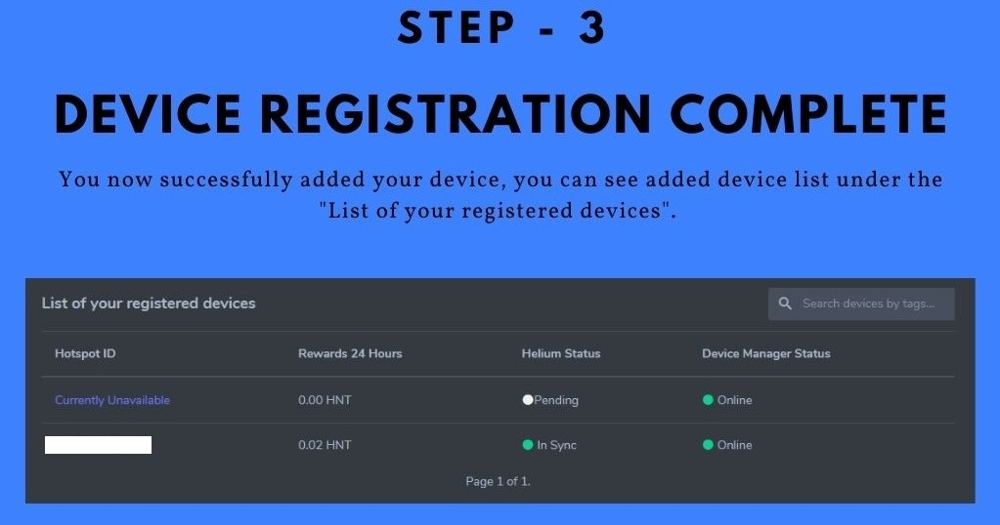

You now have successfully added your device to the dashboard and you will be able to see it under "List of your registered devices".

***

Let's take a look at the dashboard.

### Rewards section

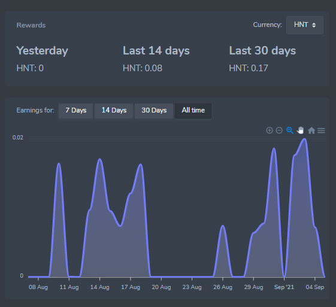

The rewards section allows you to see the rewards of all of your hotspot rewards within the last day, 14 days, and 30 days. The earnings chart shows you the earnings for each day.

### Helium Status

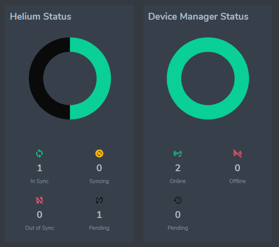

The Helium Status tab shows you how many of your hotspots are in sync, syncing, or out of sync. While the Device Manager Status tab shows you how many of your hotspots are online or offline.

### Device Details

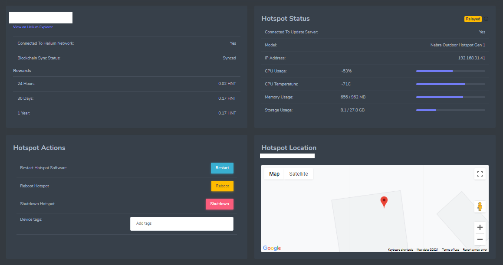

The device details will show you the connection status, individual rewards, CPU usage, CPU temperature, memory usage, and storage usage. You can also issue a number of actions to your hotspot like reboot, restart and shutdown.

##

### Transfer Device To Another Dashboard

You can transfer device from one dashboard to another dashboard very easily.

Go to Device List -> https://dashboard.nebra.com/devices/ and select **Transfer** in device property.

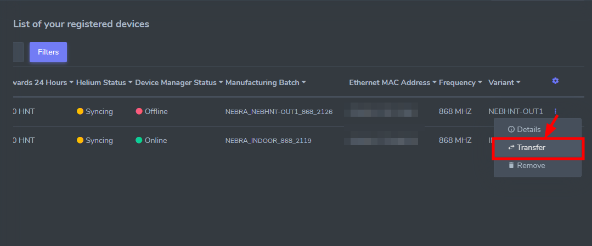

Next, you will get a warning message

> Warning! ⚠ **You are about to transfer your device to another user**

Input the email address you would like to transfer your device to.

If the recipient has a Nebra Dashboard account, the device will be transferred immediately.

If the recipient does not have an account, we will send them an invitation link.

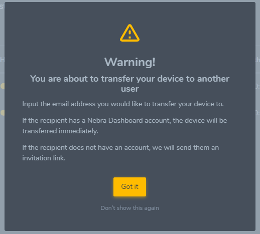

After confirming the warning message, please enter the recipient email account associted with nebra dashboard.

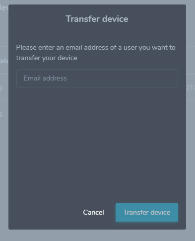

Transfer Done.

### Remove Device From Current Dashboard

You can remove the device from your dashboard For that, Go to Device List -> https://dashboard.nebra.com/devices/ and select **Remove** in device property.

Go to Device List -> https://dashboard.nebra.com/devices/

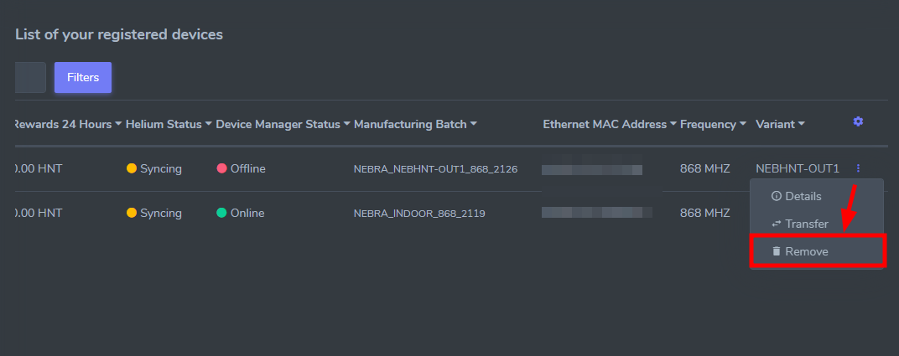

Please note, Once the device is unlinked, it will be open for anyone to add the device to their own dashboard. Only do this if you plan on transferring the device to another account.

Continue by clicking **Remove**

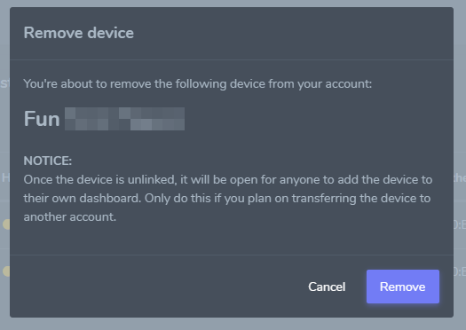

##
