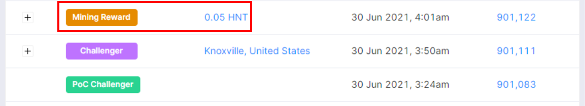
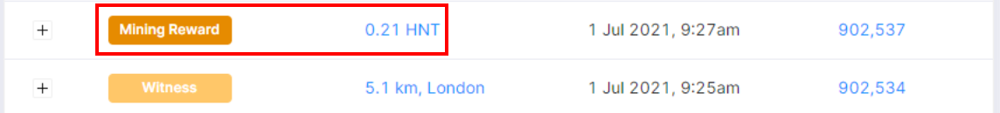

# The First Few Days – What To Expect

This guide is here to help you understand what to expect from your hotspot in the first few days and to explain the activities that you will see your hotspot perform. It will primarily cover the items involved during proof of coverage rather than data transfer and election to consensus groups. It is intended to provide an overview in simple to understand terms and not to replace the detailed documentation provided by Helium.

## Patience

It is critical to understand that in the first couple of days that all of the mechanisms that are described below will take time to establish. Until these days have passed it is unlikely that an accurate assessment of functionality or performance can be made. In order to avoid being swamped with support tickets it is requested that you respect this period before contacting support. It is also worth considering that if you have a successful beacon or witness activity that it is likely that your hotspot is functioning as expected and again contacting support is unlikely to help. In these situations you would need to look at what you can do to optimise the location of your hotspot and perhaps consider different placement or type of antenna.

It is assumed that you have upacked your hotspot and followed the [Quick Start Guide](https://helium.nebra.com/indoor-hotspot/quick-start) and that your hotspot has synchronised with the blockchain. Great so now what happens?

## The Basics

The first thing is to understand some of the basics around the different activities that the hotspot will perform including how and why they happen. The first important point is that for proof of coverage the whole network works on an average (at the time of writing) 480 block cycle. Each block is processed every 60 seconds on average and contains transactions that have taken place in that time period. From this you can see that the cycle is, in theory, every 8 hours but remember that this is an average and is based on an element of luck. It is also worth noting that there are 'external' influences including issues with congestion on the Helium network and the effect of Helium software updates which are relatively frequent at the moment due to exponential growth.

So the process works a little something like this, every time period (around 480 blocks) a hotspot will issue a challenge to another hotspot on the network via the internet. The challenged hotspot will then send out a radio signal to be witnessed by other hotspots in the local area. The hotspots that witness this beacon will then report back to the original challenger that they have witnessed a beacon. 

It is important to note that this process starts with a challenge to a random hotspot so this is the first element of luck as it is entirely possible for 2 hotspots to independently challenge the same hotspot within a short period of time. This is taken care of by the Helium network algorithms to ensure that the average will tend towards 8 hours. Yes, but what does that mean for me I hear you ask.

Well we are not quite there yet, as there is also the consideration of the placement of not only your hotspot but also of those around you. Know that you can only control what you do with your hotspots and that those around you will have the biggest influence your rewards and that you cant really assume anything about them.

I am synchronised already, why don't I see any rewards immediately? Well, remember that 8 hour cycle, it has only just started so it will take time for anything to start happening and it will depend again more on those hotspots around you rather than your own hotspot. For example things will be very different for you depending on whether there are 0 hotspots around you or if there are 100 and this is before taking in to consideration the terrain and buildings in your surrounding area. It is also worth remembering that mining rewards are only issued once per consensus cycle which are currently occurring around every 45-50 minutes. You can check this and the time between blocks on [The Helium Explorer](https://explorer.helium.com/)

## Rewards

OK, so what are the rewards? As described above, for Proof of Coverage, there are 3 different rewards that you can receive. Challenge, Beacon and Witness.

### Challenge

This is generally the lowest reward that you will receive and potentially the only one if you are a lone wolf. Your hotspot will issue a challenge to another hotspot and if successful you will receive a reward.

In the explorer you will see first a PoC Challenger activity in a green box.

This, if successful, will be followed by a Challenger activity in a purple box accompanied by details of the hotspot that you have challenged. If the challenge is not successful you will see nothing.

If you click the purple box you will be presented with the details of the hotspot that the challenge was issued to along with a graphical representation of the beacon that was issued and the witnesses.

If the challenge is successful and the beacon issued by the hotspot is witnessed then you will see a Mining Reward activity in a brown box and you will receive a reward.

An important thing to note is that if YOUR hotspot is relayed it is more likely that you will have failed challenges as the network responses from the witnesses do not reach you in good time to validate. The impact of relayed hotspots will be discussed further in the Beacon and Witness reward types.

The rewards for challenges are typically small and do not depend on your location or proximity to other hotspots.

### Beacon

If you receive a challenge from another hotspot you will issue a beacon and if it is successfully witnessed you will receive a reward.

In the explorer you will see first a Beacon activity in a blue box along with the number of witnesses. The number of witnesses can be 0 but this doesn't necessarily mean there is an issue with your hotspot.

If you click the blue box you will be presented with the details of the beacon along with a graphical representation of the witnesses.

The witnesses here are the ones that will appear in your witness list as this is a list of witnesses to you and not who you have witnessed. This is sometimes a point of confusion as it is displayed on the main page in the explorer for your hotspot. It displays all of those hotspots that have witnessed your beacons over the last few days and is likely to show more than any individual beacon.

If the beacon is succesful and is witnessed by at least one hotspot then you will see a Mining Reward activity in a brown box and you will receive a reward.

Now, another point about relayed hotspots. This time not your hotspot but the one who challenged you. If the hotspot that challenged you is relayed then there is a good chance that it will not validate the witnesses in time and the result will be 0 witnesses and 0 HNT for you. This is irrespective of the fact you may have 25 perfectly placed hotspots close to you. You can check this by clicking on the blue beacon box to inspect the transaction and then navigate to the hotspot that issued the challenge.

This is another element of luck and could negatively impact your expected rewards.

The rewards for beacons depend on many factors and you can read about them in the official Helium documents. They are typically medium/large depending on the coverage that is assessed by the Proof of Coverage algorithms.

### Witness

If you witness a beacon from a nearby hotspot you will receive a reward.

In the explorer you will see first a Witness activity in an orange box along with the details of the hotspot that sent the beacon.

If you click the orange box you will be presented with the details of the beacon along with a graphical representation of the witnesses of which your hotspot will be one.

You will see a Mining Reward activity in a brown box and you will receive a reward.

Again if the hotspot that issued the challenge to the beaconing hotspot is relayed the transaction will not be successful, in this case you will not see anything in the explorer for your hotspot.

The rewards for being a witness depend on many factors and you can read about them in the official Helium documents. They are typically medium/large depending on the coverage that is assessed by the Proof of Coverage algorithms.

## Summary

You now have the information about what is going on behind the scenes with your hotspot and what to expect. If you have been following closely you will see that the bigeest opportunity comes from witnessing hotspots that are close to you. You will beacon on average 3 times a day, but if there are 20 hotspots around you there is potential for you to witness 60 times a day. You will also understand that the cycle is an average and that there are several elements of luck that will influence your rewards.

The final point to make is that there is a process whereby Helium release software updates that are required to be implemented by all vendors. These updates are handled differently by different vendors and are applied at different times. This in itself causes some instability in the average cycle times and it is likely that after any software update issued by Helium that rewards will be affected for a period of time.

If after reading and digesting the information here you still believe that you have an issue it is worth first directing you query to the Nebra Discord channel as there are many community members with experience of what to expect and the issues faced by new users. Failing that please feel free to contact support at sales@nebra.com
