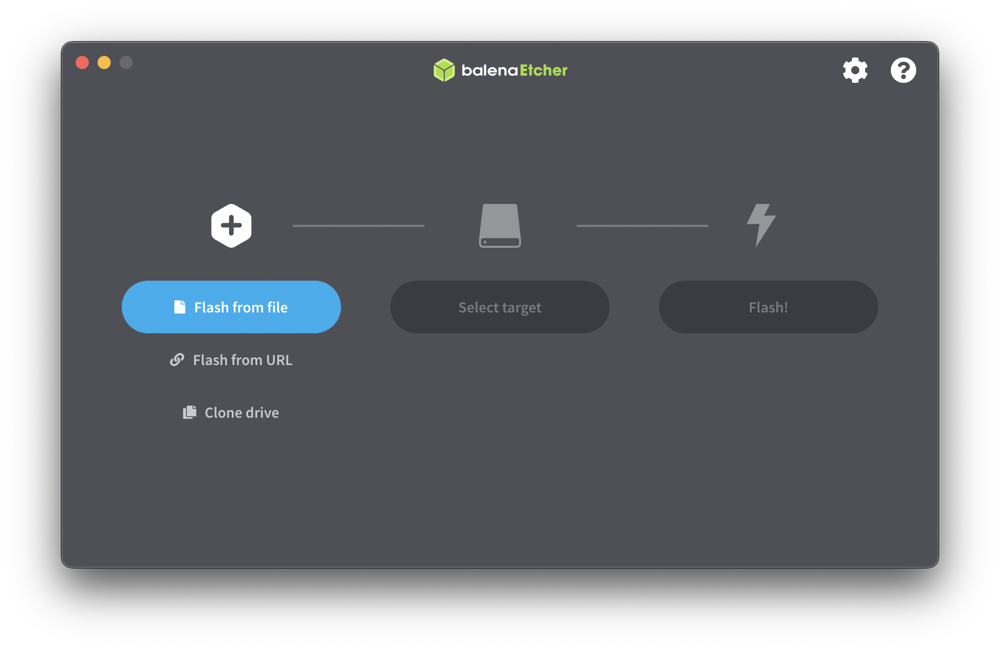
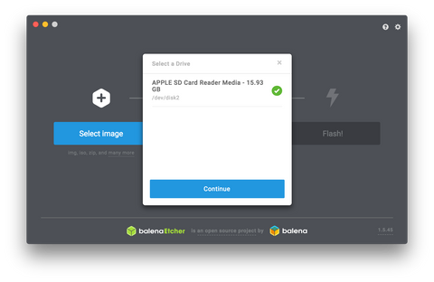

# How to Flash your SD card for Nebra Firmware Update Support

This guide will show you how to Flash new Firmware to your Hotspot miner so you can update the software and allow access to the local IP Nebra dashboard and in the future Nebra Dashboard for fleet management. This guide is intended for use with RAK Wireless, SenseCAP, Finestra, Pisces, OG and more coming soon.

## What you will need

* OS Image file specifically for your manufacture of Hotspot (See Step 4)
* microSD card reader (with SD adaptor)
* Computer (Windows or MAC)
* Helium miner Hotspot

This guide is not intended for current Nebra hotspots. Do NOT flash this Firmware on your Nebra hotspot

## Flashing your Helium miner

**Step 1** - First of all you will need to remove the current micro SD card that is inserted into your Helium miner. You will need to follow the instructions from your manufacturer to see how to do this.

**Note: You may void your warranty when doing so. Please seek permission from the manufacturer first.**

**Step 2** - Insert the micro SD card either into an SD adaptor or if your memory card reader takes micro SD then insert it into that and connect to your computer.

**Step 3** - On your computer download and install Balena Etcher from - https://www.balena.io/etcher/

Once downloaded go ahead and open up Etcher program.

**Step 4** - Before we move to the next step you will need to download the latest Openfleet software for your miner, which you can find here:

* RAK - https://hub.balena.io/nebraltd/helium-rak
* Helium OG - https://hub.balena.io/nebraltd/helium-og
* Sensecap - https://hub.balena.io/nebraltd/helium-sensecap
* Finestra - https://hub.balena.io/nebraltd/helium-finestra
* Controllino - https://hub.balena.io/nebraltd/helium-controllino
* Pisces - https://hub.balena.io/nebraltd/helium-pisces

**Step 5** - Click on the **"Flash from File"** button in Etcher and navigate to where you saved your Firmware image file and select it to be installed.

In the middle click **“select target”** to select your SD card to install the OS (It may be selected automatically).

Finally, click on the **"Flash!"** button to begin installing the OS to your SD card (you may need to type your login password).

**Step 6** - Once it has finished you can now remove the SD card from its adaptor and memory card reader and then insert it back into the Helium miner.

**Step 7** - Finally assemble the case back and connect your Ethernet cable and then the power adaptor. The Hotspot should now boot up with your new Firmware installed. It may take up to 30 minutes to sync all the updates.

**Note: You must use Ethernet for the first initial boot**
