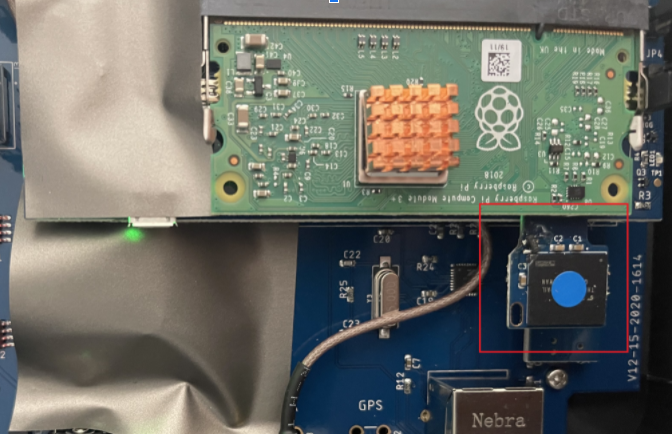
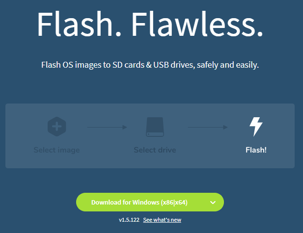
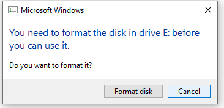
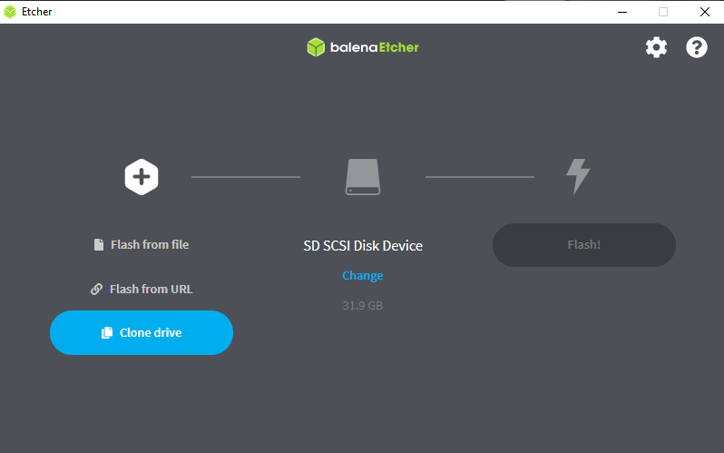
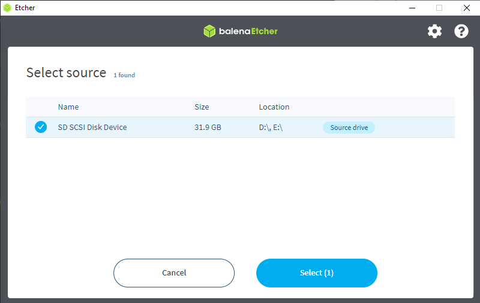
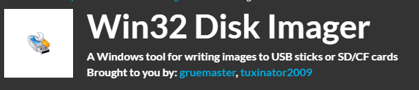

### Contents

* [Overview](#hotspot-backup-guide) 
* [External eMMC Module Clone](#external-emmc-module-clone)

# Hotspot Backup Guide 

In this guide, we will be looking into "How to backup hotspot software". 

Each device firmware is tightly coupled with their account so it's important to keep the backup in case something wrong happens.

## External eMMC Module Clone

Few device are shipped with external eMMC module. 

#### Required Tools

* Nebra external eMMC module 
* 32 GB Class 10 SD card 
* SD card  USB Reader 
* Desktop/Laptop Computer 

#### Step 1: Disconnect power and open Hotspot then Remove the external eMMC module. 

##### Step 1.1: Disconnect hotspot power 

##### Step 1.2: Open Hotspot -  Remove four screws/ use a plunger tool pop-up the lid if you  don’t have a screw )

##### Step 2.4: Remove the external eMMC module. 

#### Step 2: Download and install [Balena Etcher](https://www.balena.io/etcher/). 

#### Step 2: Connect external eMMC to computer. 

If you getting any warnning like this, please ignore. **DO NOT FORMAT!**

#### Step 3: Open "Balena Etcher" select "Clone drive" option. 

#### Step 4: To clone select your source as eMMC drive. 

#### Step 5: Connect new 32 GB memmory card and select as backup "target"

## External eMMC Module '.img' File Backup 

#### Required Tools

* Nebra external eMMC module 
* 32 GB Class 10 SD card 
* SD card  USB Reader 
* Windows Computer

#### Step 1: Disconnect power and open Hotspot then Remove the external eMMC module. 

##### Step 1.1: Disconnect hotspot power 

##### Step 1.2: Open Hotspot -  Remove four screws/ use a plunger tool pop-up the lid if you  don’t have a screw )

##### Step 2.4: Remove the external eMMC module. 

#### Step 2: Download and Install [Win32 Disk Manager](https://sourceforge.net/projects/win32diskimager/)

#### Step 3: Connect external eMMC to computer via SD card reader. 

#### Step 4:

