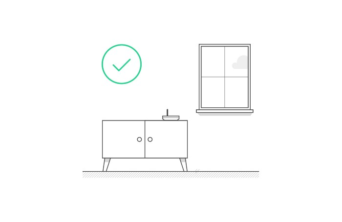
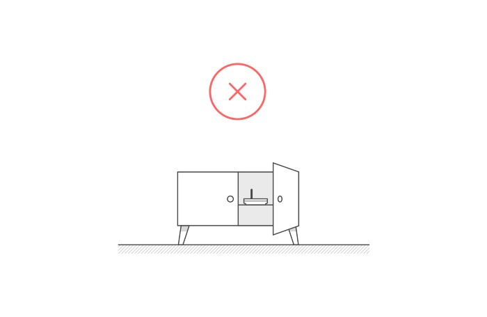
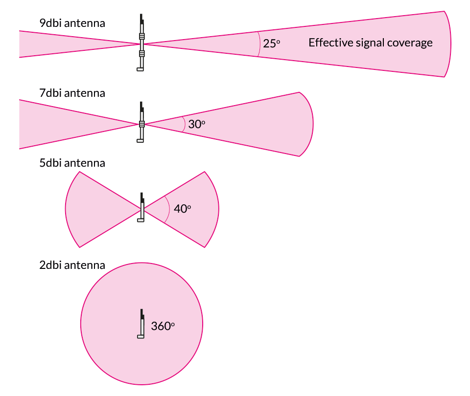
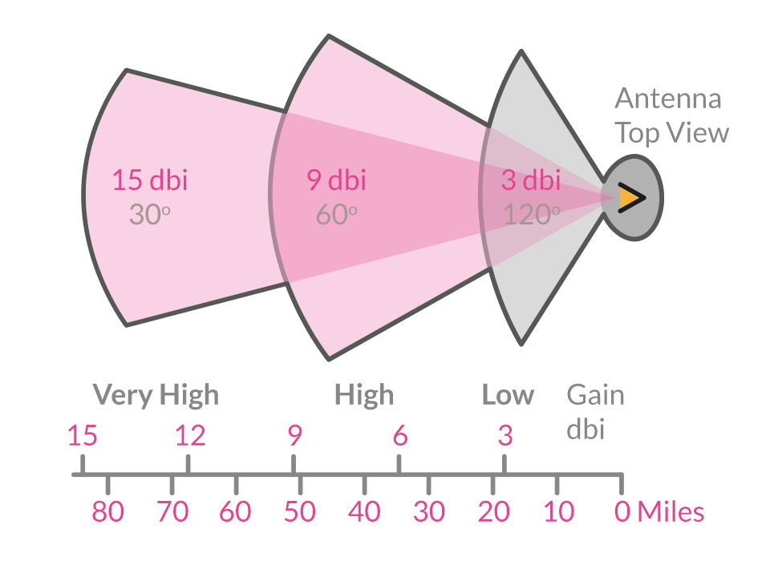
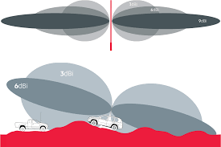

# Ideal Hotspot Placement 

On the Helium Network, participants earn HNT by mining and building coverage for The People’s Network using compatible Hotspots.

Hotspot miners earn HNT in two different ways:

* **Proof-of-Coverage** : Hotspots on the network are randomly and automatically assigned Proof-of-Coverage tests to complete. Passing and witnessing tests earns HNT. You can read more about the mechanics of PoC on [the Helium website](https://docs.helium.com/blockchain/proof-of-coverage).

* **Relay Device Data** : Hotspots earn HNT for transferring device data over the network. The more device data a Hotspot transfers, the more it earns. There are more details on [the Helium website](https://docs.helium.com/blockchain/helium-token).

Hotspot visibility and participation in the network directly correlate with the rewards earned.

Some external factors include the number of **hotspots nearby you**, and the **hotspot density**. These can both affect your rewards.  

## Hotspot Location/Antenna View

Hotspots like to be deployed high up, overlooking wide-open spaces. If you have a house or apartment building with multiple floors, aim for the highest floor with a window. Ideally, your Hotspot has a clear view of the sky. (src: [blog.helium.com](https://blog.helium.com/helium-hotspot-101-1aa9dcecb5e))

Things to consider when placing your hotspot: 

* Walls and windows can decrease or block your signal.
* It's best to have the hotspot mounted high, with a clear line of sight.
* Long cable length can severly effect antenna performance.

 

Avoid putting the Hotspot in locations where signal strength can be heavily degraded; Such locations include, but are not limited too: basements, cabinets, behind TVs, metal screens, or ‘cyberglass’. (src: [blog.helium.com](https://blog.helium.com/helium-hotspot-101-1aa9dcecb5e))

 

Hotspots should not be deployed too close to one another. It's best to provide a minimum distance of 300 to 500 meters between Hotspots. You typically encounter a stronger density in cities, and a weaker density in rural enviorments.(src: [blog.helium.com](https://blog.helium.com/helium-hotspot-101-1aa9dcecb5e))

Reaching a good transmit scale is optimal for earnings. For more information about transmit scale, hotspot density, and attenna details, please view the following resource - src: [nikhawks.medium.com](https://nikhawks.medium.com/a-rough-guide-to-helium-hotspot-placement-bb96b0b81343)

Good elevation placement in a suburban location:

 
src: [nikhawks.medium.com](https://nikhawks.medium.com/a-rough-guide-to-helium-hotspot-placement-bb96b0b81343)

## Appropriate Antenna 

A stronger antenna doesn't necessarily mean better coverage, or better earnings. Take a look at the images above and notice the different coverage for antennas. **The higher the dBi antenna is, the narrower and longer its signal coverage becomes**.

| Antenna Length vs dBi | Antenna Reception |
|---| ---|
| |  | 

* Higher dBI: Great performance on flat terrain and low hotspot density.
* Lower dBI: Great performance on uneven terrain, or areas with a high hotspot density.
* Middle dBI: Perfect for those environments that fall in between the other environments described above.

You can read more about antenna [here](../handy-guides/antenna/overview.md) 

## Antenna cables 

Antenna cable can also affect your signal, and consequently, your rewards. 

All cables provide some signal loss, it\'s important to be able to calculate and account for these variables. 

Here is a table of cables, and the loss encountered while using them. 

| TYPE OF CABLE  |  LOSS / M  | DIAMETER |
|----------|:-------------:|------:|
| LMR-600 | ~0,08 dBm | 15 mm |
| LMR-400 | ~0,10 dBm | 10 mm |
| HDF-400 | ~0.13 dBm | 10 mm |
| LMR-300 | ~0.15 dBm | 08 mm |
| RG-401  | ~0.18 dBm | 6.4 mm |
| LMR-240 | ~0.24 dBm | 6 mm|
| RG-142  | ~0,25 dBm | 5 mm|
| RG-402  | ~0,25 dBm | 3.6 mm|
| RG-213/214 | ~0.26 dBm | 10 mm |
| RG-8X   | ~0.42 dBm | 6.4 mm|
| RG-405  | ~0.45 dBm | 2.1 mm|
| RG-58   | ~0.50 dBm | 5 mm |
| HDF-200 | 0.59 dBm  |	5 mm |
| RG-178  | ~1.00 dBm | 2 mm | 
| RG-174  | ~1.00 dBm | 2.5 mm| 

More details at [Antenna Connectors](handy-guides/antenna/connectors.md) 

#### Resources
* [Hotspot Placement Tool ](https://app.hotspotty.net/)

* [Antenna Height and Communications Effectiveness by ](https://www.arrl.org/files/file/antplnr.pdf)

* [A Rough Guide to Helium Hotspot Placement by Nik Hawks](https://nikhawks.medium.com/a-rough-guide-to-helium-hotspot-placement-bb96b0b81343)

* [Helium Hotspot 101 by  Mark Phillips](https://blog.helium.com/helium-hotspot-101-1aa9dcecb5e)

* [Helium ($HNT) Perfect Miner Placement - How Much I Earned In 1 Month](https://youtu.be/4gwvPywnhtI)
