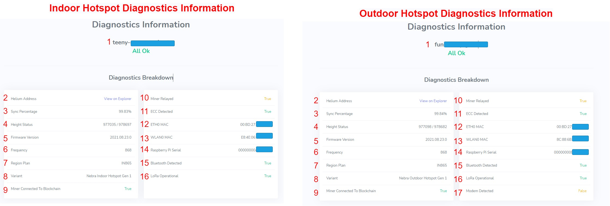

# Local Diagnostics

There are two different methods to access the diagnostics information of your Nebra hotspot:

1. Helium App Diagnostics(Bluetooth)
2. Nebra Diagnostics(Private IP Address)

## IP diagnostics

We highly recommend utilizing the **Nebra Local Diagnostics Page**. To do so, Identify the private IP address of your hotspot by retrieving the information from Helium App Diagnostics over Bluetooth, or by using your router's admin page (Typically can be accessed by typing 192.168.1.1 into a web browser, but not all routers are the same, for more details regarding your specific router, please visit some of the router guides found [here](https://portforward.com/router.htm)).

You can typically do all of these steps on a mobile device, laptop, or desktop. Once you have identified the IP address of your unit, you will be able to access a page that looks like this:

### What information can you find in here

1. **Hotspot animal name**: animal name of your hotspot.

2. **Helium address**: address of your Helium hotspot here. (Clicking this will directly lead you to the helium explorer)

3. **Sync percentage**: This shows an up-to-date sync status of your Helium hotspot. This information will be updated every 2 minutes. Sometimes it will show as **Miner is Still Loading** - This can have different causes:
* Your hotspot is still booting up
* The Height status is higher than the blockchain height reported by the Helium API.
* There is an issue with the Helium miner software and it won't fully load up
* Most of these issues will resolve over time as various counter measures will activate to keep your Hotspot 100% synced and up-to-date.

4. **Height status**: It will show the block your hotspot is currently synced up to and the total blockchain height reported by the Helium API

5. **Firmware version**: The current firmware version that is running on your hotspot

6. **Frequency**: Shows the frequency plan your hotspot is using. It will show 470/ 868 or 915 based on the region the hotspot is operating in.

7. **Region Plan**: Shows the exact frequency your hotspot is using

8. **Variant**: Shows the variant of your hotspot (Indoor/ Outdoor and the generation of your hotspot)

9. **Miner connected to Blockchain**: Will say yes if your hotspot has a good connection to the Helium network. Even when showing no your hotspot can still be connected to it, but it has less than 5 peer to peer connections. This will be updated in the future.

10. **Miner Relayed**: ~~Indicates if your hotspot is relayed. View our Port Forwarding guide if you are having trouble eliminating the relayed status.~~ Soon to be removed see [Port Forwarding Guide](../handy-guides/port-forwarding/overview.md)

11. **ECC detected**: Shows True if your secure chip is detected. If it shows as false, check the hardware, reseat components. If the problem persists, contact us at support.

12. **ETH0 MAC**: The Ethernet MAC address of your hotspot. Provide this to support when you open a ticket with us. It is a unique identifier for your unit and should be kept private otherwise.

13. **WLAN0 MAC**: The Wifi mac address of the hotspot. Shows Unknown if there is an issue with the Wifi on your hotspot.

14. **RPi Serial**: The serial number of the Raspberry Pi used in your hotspot. It is used with the ETH MAC address to add a hotspot to the Nebra Dashboard.

15. **BT detected**: Indicates if the bluetooth is connected.

16. **Lora OK?**: Checks if the Lora module is recognized by your hotspot. It will be showing as **False** if no location is asserted to the hotspot. Please check if your hotspot is Waiting for Location Assertion. If the region is correctly detected and it's still showing as **False** please reach out to our Support.

17. **Modem Detected** : Check if the Cellular LTE module is reconginzed by your hotspot. If it is showing as **False**, turn off the hotspot and reseat the LTE module. Please note the Outdoor unit does't comes with LTE module pre-installed, it will show **False** as default.

## In-app diagnostics

To access the Helium Bluetooth diagnostics, your hotspot needs to be in pairing mode. Your hotspot is in pairing mode directly after startup. You can initiate pairing mode manually by pressing the pair button on the back of your hotspot for 10 seconds. You will now be able to pair with the hotspot in the helium app. If you are unaware of how to do this, simply click on the cog symbol on the top right corner and a new menu will appear. Choose Pair. Your hotspot will now appear.

### What information can you find in here

* **Hotspot name**: The animal name of your hotspot.

* **Peer-to-Peer Connections**: Here you can see if your hotspot has successful Outbound and Inbound connections. It can take up to 15 minutes to update this information. If you have no inbound connections, this is an indicator that your hotspot is relayed. Refer to our port forwarding guide.

* **Blockchain Sync**: This sync status is not always up-to-date and will show as 100% even though the hotspot still might be syncing. This is where we advise using the Nebra diagnostics page for more accurate information.

* **Last Challenged**: Shows when the hotspot was challenged the last time. It will only participate in challenges when it is fully synced and has an internet connection.

* **Hotspot Maker**: The maker of your Hotspot. In our case it will show as Nebra LTD.

* **Hotspot Firmware** : The firmware version your hotspot is using.

* **App Version**: The version of the Helium app your are using.

* **Wi-Fi MAC**: The Wi-Fi MAC address of your hotspot.

* **Ethernet MAC**: The Ethernet MAC address of your hotspot. Provide this to support when you open a ticket with us. It is a unique identifier for your unit and should be kept private otherwise.

* **NAT Type**: Shows the NAT type of your hotspot. This can indicate if your hotspot is Relayed. NAT-type showing none and unknown is ideal and what you want. With a symmetric NAT-type, you share an IP address with others, so port forwarding may not be possible. It can be resolved by asking for a unique IPv4 address from your ISP. Restricted means that the port is blocked.

* **IP Address**: The local IP address of your hotspot. By entering it in the browser you are able to access the Nebra Diagnostics page of your hotspot for more accurate information.

* **Report Generated**: Date when the diagnostics were produced.

## Still having trouble?

If the above tips haven't been able to resolve your issue then get in touch at https://nebra.io/helium-support and we'll work on resolving your issue. But be sure to please perform the steps above to perform the update process.
