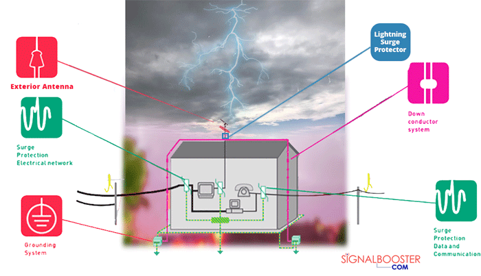
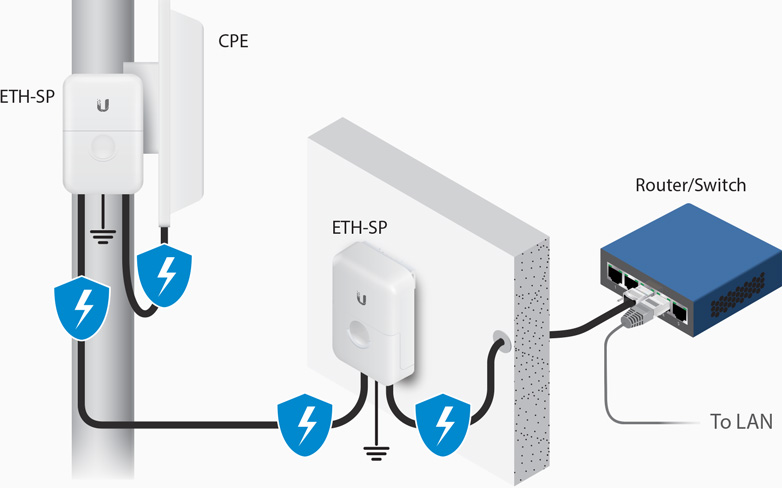

# Surge Protectors 

 src: signalbooster.com

A surge protector is an electrical appliance that is used for **protection of the equipment against power surges and voltage spikes** while simultaneously blocking voltage over a safe threshold.  When it surpasses safe threshold, the surge protector shorts to ground voltage or even blocks it. If you don’t use surge protectors, then anything above the safe threshold can create component issues like permanent damage, reduced lifespan of internal devices, burned wires, and data loss.

A voltage spike is a transient event, typically lasting 1 to 30 microseconds, that may reach over 1,000 volts. Lightning that hits a power line can give a spike of over 100,000 volts and can burn through wiring insulation and cause fires, but even modest spikes can destroy a wide variety of electronic devices, computers, battery chargers, modems and TVs etc, that happen to be plugged in at the time.

## Surge Protectors vs. Power Strips

Power strips and surge protectors, also called surge suppressors, are different. 

Typically, power strips are cheap, multi-outlet products that are merely an expansion of a wall outlet. These usually have a circuit breaker (on/off switch) of some sort, but most don't offer any real "protection" from electrical issues. Some might have the barest level of protection, but they're all pretty much just like plugging into the wall direct.

Surge protectors are relatively cheap too, but unlike power strips they offer some level of protection against power spikes. How much and how well varies considerably. more at: [cnet.com/how-to/10-things-you-should-know-about-surge-protectors](https://www.cnet.com/how-to/10-things-you-should-know-about-surge-protectors/)

## Antenna Surge Protector

This goes between the antenna and the hotspot and should be grounded. This one helps protects the hotspot against damage.

You can purchase [Pi-Supply](https://uk.pi-supply.com/) antenna surge protector here at https://uk.pi-supply.com/products/antenna-surge-protector

## Ethernet Surge Protector

This goes between the hotspot and your ethernet router / switch. This one would only help protect against other devices getting damaged and not the hotspot itself.

