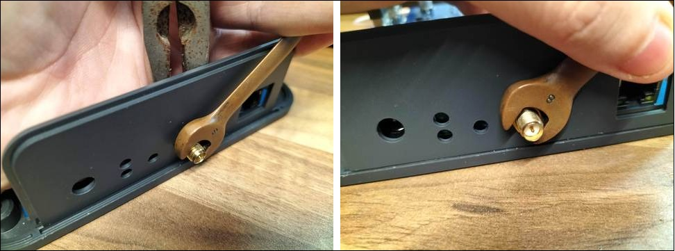

# Indoor Hotspot FAQs

## What is the antenna connector on the Hotspot?

Click to expand!

The indoor unit has a RP-SMA Female Connector on, and the outdoor unit has an N-Type female connector on.

## Can I add 4G connectivity to my Indoor Hotspot?

Click to expand!

No, the indoor unit does not have the ability to have a 4G Modem added, you could use a solution like a MiFi or 4G to Ethernet module to achieve the same result.

## How much internet data per month does the Hotspot use?

Click to expand!

Currently we are roughly estimating 30-50GB per month.

The actual usage may be slightly less or more and will be something we up-date over time as we start measuring more units.

## What antenna is included with the Hotspot?

Click to expand!

A 3dBi Omni-directional antenna is included with the Nebra Indoor Hotspot, specifications can be found on the [Overview](../indoor-hotspot/overview.md) page.

## Can I use PoE with the Indoor Hotspot?

Click to expand!

If you wish to use PoE with the Indoor Hotspot you will require an active PoE splitter that outputs 12V to the unit. Alternatively you can use passive PoE adapters as long as the power provided to the unit is between 9 and 16 Volts and can provide 15W of power.

## How long does it take for my Hotspot to sync with the network?

Click to expand!

This can vary depending on your internet connection's speed. However, in our testing it takes approximately 24-48 hours for the initial synchronisation to be completed.

## How to remount the indoor miner daughter board?

Click to expand!

* **Step 1:** Remove the screws from the bottom of the case to take off the lid. 
* **Step 2:** Then re-insert the daughter board into the 60 pin header and then reassemble 

That's all, you should be good to go. 

Here's a short video showing you how to re-mount the daughterboard...

<iframe width="560" height="560" src="https://www.youtube.com/watch?v=3g28DGvG3Jw" title="YouTube video player" frameborder="0" allow="accelerometer; autoplay; clipboard-write; encrypted-media; gyroscope; picture-in-picture" allowfullscreen></iframe>

## How to fix lose antenna connector?

Click to expand!

This can be rectified by first removing  the 4 screws to take the lid off. Then use a pair of needle nose pliers or an M8 spanner, along with another M8 Spanner the other side to tighten it up.

## I have an issue but it's not listed here?

Click to expand!

If your issues cannot be resolved by using the troubleshooting page then please email [sales@nebra.com](mailto:sales@nebra.com) and include the following information:

* Model of unit:
* Mac address of the unit (Shown as ETH on sticker):
* Frequency of the unit (Shown as Freq on sticker):
* How are you connecting it to internet? (Ethernet, Wi-Fi, Cellular):
* How are you powering the unit? (Included adaptor, POE, Third party adaptor): If the issue relates to 
* initial setup of the hotspot:
* What make & model of phone are you using?
* What version of the Helium App are you using?
* Do you have any screenshots of any error codes? 

