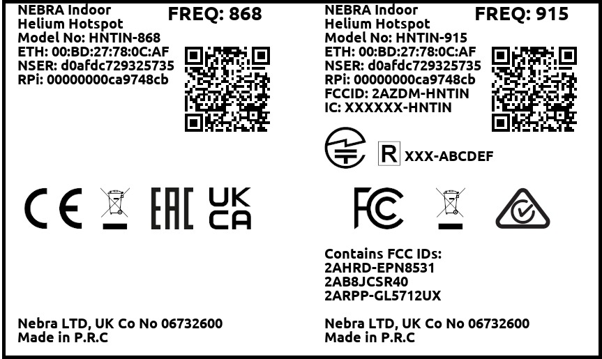

# Indoor Helium Hotspot Overview

The Nebra Indoor Helium Hotspot is a compact & elegant solution to provide Helium LongFi coverage and start mining HNT with ease.

## Quick Specifications

| Specification | Nebra Indoor Hotspot |
| --- | ---  |
| **RRP** | £250 ex VAT |
| **Case** | Plastic (ABS) |
| **Ingress Protection** | IP40 |
| **Dimensions** | 150x150x50 mm (Excluding Antenna) |
| **Weight** | 0.4 Kg |
| **Power Requirement** | 9-16V DC @ 15W |
| **Average Power Consumption** | ~8W* |
| **Annual Power Consumption** | ~70kWh |
| **Maximum TX Power** | 24-27dBm** |
| **Network Connectivity** | 10/100 Ethernet, 2.4Ghz 802.11N Wi-Fi |
| **Antenna Connection** | RP-SMA Female |
| **Rated Ambient Temperature** | 20-30C |
| **Base SOM** | Raspberry Pi CM3+ |
| **CPU Specification** | Broadcom BCM2837B0, Quad Core Cortex-A53 (ARMv8) 64-bit SoC @ 1.2GHz |
| **High Endurance Storage** | 32GB |
| **RAM** | 1GB LPDDR2 SDRAM |
| **Internal PCB Dimensions** | ~ 139x139x30 mm |

###### * Average Power Consumption Measured At Mains,
###### ** Maximum TX Power may be capped to a lower amount in some regions.

## Package Contents

* The Nebra Helium Indoor Hotspot
* RP-SMA LoRa Antenna
* Worldwide 12V 1.5A Power Adapter + Adaptors
* 1M CAT5 Ethernet Cable

*Please note the above image is for illustrative purposes only, colours of some parts may change.*

## Block Diagram

## Supported Regions

The Nebra Indoor Hotspot comes in three frequency versions:

| Frequency | Supported Regions |
| --- | ---  |
| **470 Mhz** | CN470 |
| **868 Mhz** | EU868, IN865, RU864 |
| **915 Mhz** | US915, AU915, AS923, KR920 |

The frequency is set upon initialisation by the Helium Network.

## Antenna Specifications

| Specification | 470Mhz Model | 868 & 915Mhz Models |
| --- | --- | --- |
| **Frequency Range** | 420-480 | 860-930 Mhz|
| **Peak Gain** | 3 dBi | 3 dBi |
| **VSWR** | &lt; 2.3 | &lt; 1.8 |
| **Input Impediance** | 50 Ohms | 50 Ohms |
| **Length** | 17.2CM | 20.7CM  |

## Dimensions

The Nebra Indoor Hotspot is 150x150x50MM In size when nothing is connected.

Approximatley 175x150x50MM space is required when accounting in space required for connectors.

## Interfaces

#### Connectors

1.  9-16V @ 15W DC 6.5MMx2.0MM Barrel Jack
2. LED Indicator.
3. Interface Button
4. RP-SMA LoRa Connector
5. Ethernet Connector

#### Status Indicator

The Nebra Indoor Hotspot has a status indicator as shown above.

The Top LED will act accordingly:

* Off - Software has not started yet.
* On - Operating as normal
* Slow Blinking - Bluetooth Pairing is enabled
* Fast Blinking - There is potentially a fault. Please check diagnostics page.

The Bottom LED acts accordingly:

* Off - Unit is receiving no power.
* On - Unit is powered up.

#### Button

The Nebra Indoor Hotspot has a button on the back of the unit.

This is used to re-enable bluetooth pairing on the hotspot, hold the button in for approximately 15 seconds then release to start pairing. The top light should start blinking slowly if successful.

## Firmware

The Nebra Hotspots run a customised software to provide high reliability and ensure your units are as up to date as they can be.

Approximately your hotspot will update once a week in an automatic process, we will announce updates via various social media platforms when they happen.

The software is open source at https://github.com/nebraltd/helium-miner-software

## Unit Information
Each unit has a sticker located on the base of the unit.

This includes important Information including:

* Frequency of the Unit
* Ethernet MAC address
* Nebra Serial Number
* Raspberry Pi Serial Number

You will require some of this information when linking your unit to our Dashboard.

## Certifications

We are working on getting the Nebra Indoor Hotspot certified in multiple regions. As we have results from the certification process we will post them here.

#### Certification List

| Approval | Countries Covered | Hardware Frequency | Status | Frequency Plans |
| --- | --- | --- | --- | --- |
| CE | European Economic Area | 868 Mhz | [Completed](https://helium.nebra.com/certifications/indoor/CE/RED%20VOC.pdf) | EU 868 |
| UKCA | United Kingdom | 868 Mhz | [Completed](https://helium.nebra.com/certifications/indoor/UKCA/JYTS287_UK_Cert.pdf) | EU 868 |
| FCC | United States of America | 915 Mhz | [Completed](https://helium.nebra.com/certifications/indoor/FCC/P21SZ04076%20FCC%20ID%202AZDM-HNTIN.pdf) | US 915 |
| ISED | Canada | 915 Mhz | In Progress | US 915 |
| RCM | Australia & New Zealand | 915 Mhz | [Completed](https://helium.nebra.com/certifications/indoor/RCM/JYTSZB-R01-2100219%20ASNZS%20CISPR%2032.pdf) | AU 915 |
| MIC | Japan | 915 Mhz | In Progress | AS 923-1 |
| SRRC | China | 470 Mhz | In Progress | CN 470 |
| EAC  | Russia | 868 Mhz | In Progress | RU 864 |
| WPC | India | 868 Mhz | In Progress | IN 865 |

All certification related documents can be viewed at https://helium.nebra.com/certifications/indoor/

#### Certification Codes

| Certification | ID Code |
| --- | ---  |
| FCC | 2AZDM-HNTIN |
| ISED | 27187-HNTIN |

#### FCC Statement

This device complies with Part 15 of the FCC Rules. Operation is subject to the following two conditions:

1. This device may not cause harmful interference.
2. This device must accept any interference received, including interference that may cause undesired operation.

Changes or modifications not expressly approved by the party responsible for compliance could void the user's authority to operate the equipment.

NOTE:
This equipment has been tested and found to comply with the limits for a Class B digital device, pursuant to Part 15 of the FCC Rules.
These limits are designed to provide reasonable protection against harmful interference in a residential installation.
This equipment generates uses and can radiate radio frequency energy and, if not installed and used in accordance with the instructions, may cause harmful interference to radio communications.
However, there is no guarantee that interference will not occur in a particular installation.

If this equipment does cause harmful interference to radio or television reception, which can be determined by turning the equipment off and on, the user is encouraged to try to correct the interference by one or more of the following measures:
* Reorient or relocate the receiving antenna.
* Increase the separation between the equipment and receiver.
* Connect the equipment into an outlet on a circuit different from that to which the receiver is connected.
* Consult the dealer or an experienced radio/TV technician for help.
