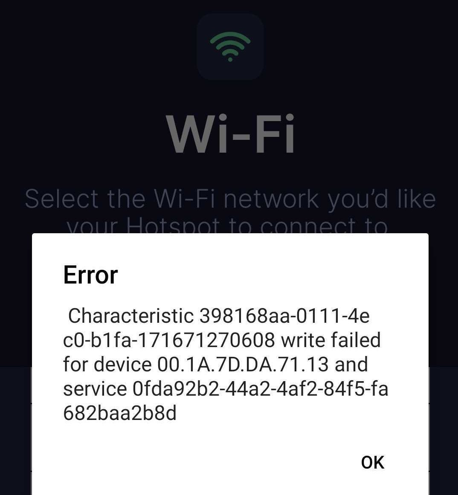

# Indoor Hotspot Troubleshooting

If you are having trouble with setting up your hotspot or you have got a query, the following tips may help.

* [No lights are turning on](#no-lights-are-turning-on) 
* [How to access the diagnostics](#how-to-access-the-diagnostics) 
* [Updating Nebra Hotspot Firmware](#updating-nebra-hotspot-firmware)
* [Hotspot is not showing in the Helium App](#hotspot-is-not-showing-in-the-helium-app)
* [Hotspot is not detecting Wi-Fi networks](#hotspot-is-not-detecting-wi-fi-networks)
* [Updating your Nebra Hotspot](#updating-your-Nebra-Hotspot)
* [Application error while setting up](#application-error-while-setting-up)
* [Syncing Issues](#syncing-issues)

### How to access the diagnostics

On the Nebra Helium Hotspots we have two local diagnostics tools that can help you to find any issues with your miners.
  
Please take a look at the dedicated [local diagnostics page](../handy-guides/local-diagnostics.md) for more information.

### No lights are turning on

You should see the lower light on the back of the unit turn on as soon as power is applied.
If this is the case, ensure the power supply is firmly plugged into the wall outlet, the power jack is plugged into the unit and that the wall outlet is switched on.

Upon power up the lower LED (yellow) should light up instantly. Approximately after a minute the top LED (green) should then start blinking.

### The Green LED is blinking rapidly with few seconds intervall 

The upper light on the back fo the unit blinks rapidly with few seconds intervall. This is expected behaviour. 
If this is the case, use your web browser to access diagnostic page of the hotspot. If the diagnostic page does not show any error everything is fine. 

### Hotspot is not showing in the Helium App

It can sometimes take 1 minute from turning the power on for the Hotspot to show in the App.
Re-scanning a few times can then find the hotspot.

Ensure Bluetooth is turned on as this is how the application communicates with your Hotspot.

You will have had to have granted location permissions for the Application to access Bluetooth services correctly.

### Hotspot is not detecting Wi-Fi networks

You may find that sometimes your Wi-Fi network will not show in the application if the signal is poor where the Hotspot is located.

### Updating Nebra Hotspot Firmware

If after completing the initial troubleshooting steps above, you are still having issues, you may find your issues can be resolved by ensuring it is running the latest up to date software.

Nebra Hotspots automatically update once connected to the internet, if you are using an Ethernet connection leaving the hotspot for around half an hour should ensure all updates are downloaded.

If you are having difficulties connecting your Hotspot to Wi-Fi, then it would be recommended to move it to a location where you can plug it into an Ethernet connection for half an hour to let it perform updates. Then move it back to the normal location and re-try setup.

### Application error while setting up

If you get an error like this while setting up your miner:

Please close your Helium app completely and turn off the bluetooth on your device. Then turn on bluetooth agin, open the app and try again. 

If you get a different error then please let us know!

### Syncing Issues

The Helium Syncing Process sometimes takes some time. Some customers report that the hotspot takes multiple days to sync properly. This is not so much an issue with Nebra, rather an issue with the Helium blockchain itself. Please allow the hotspot to take some time, especially during the 90% mark. If you are still having trouble, feel free to contact support below. If you are not familiar with Nebra's diagnostics page, we highly recommend connecting to your hotspot directly using the local IP address in combination with a web browser. This will provide more insight between the device, and the Helium blockchain.

## Still having trouble?

If the above tips haven't been able to resolve your issue then get in touch at https://nebra.io/helium-support and we'll work on resolving your issue. But be sure to please perform the steps above to perform the update process.
