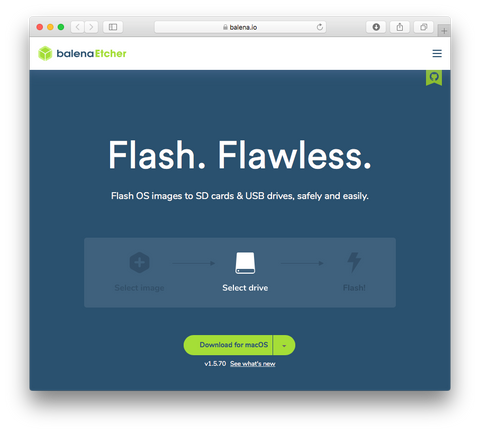
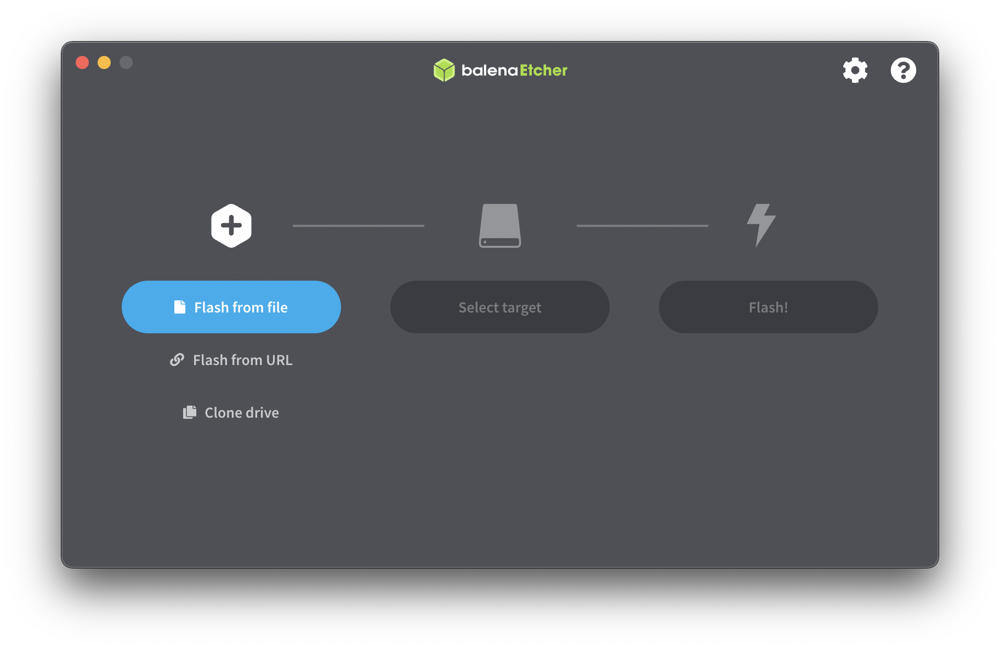
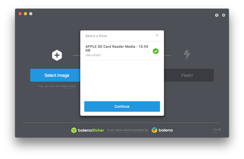
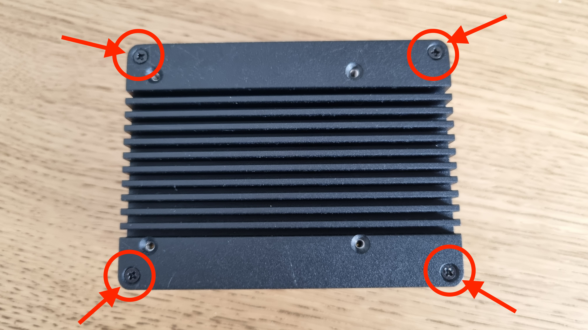
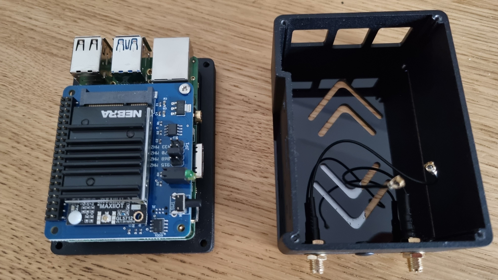
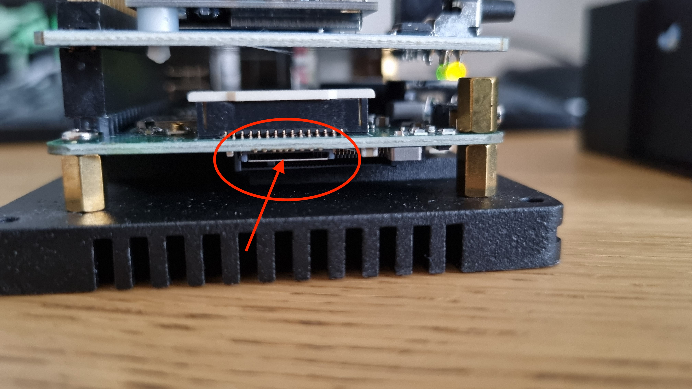
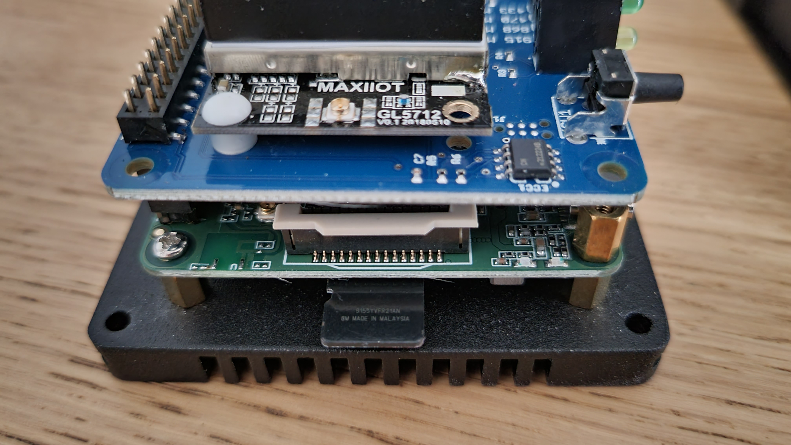
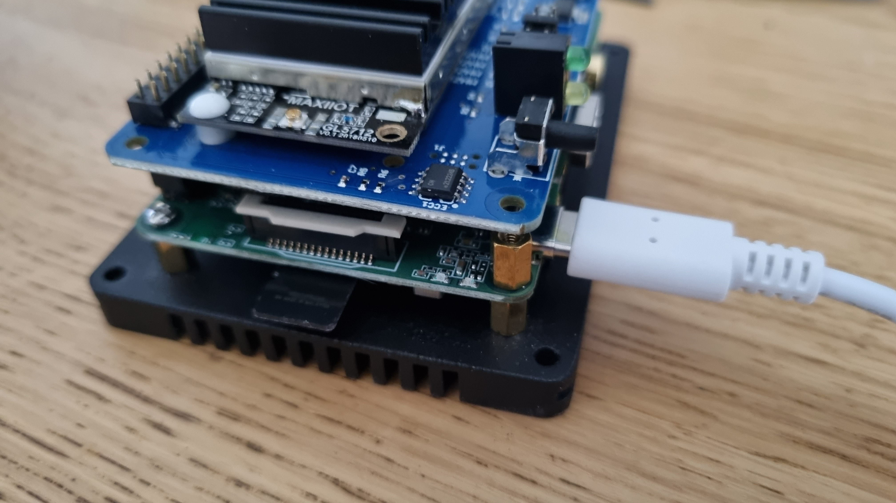
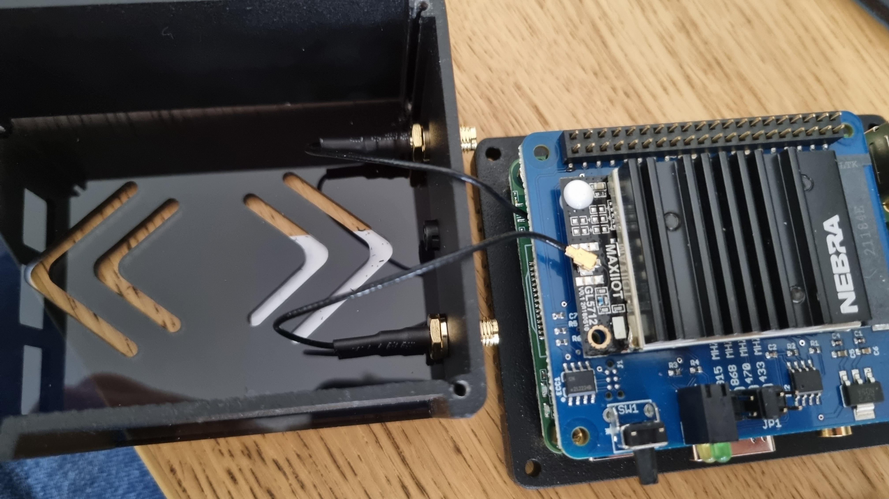
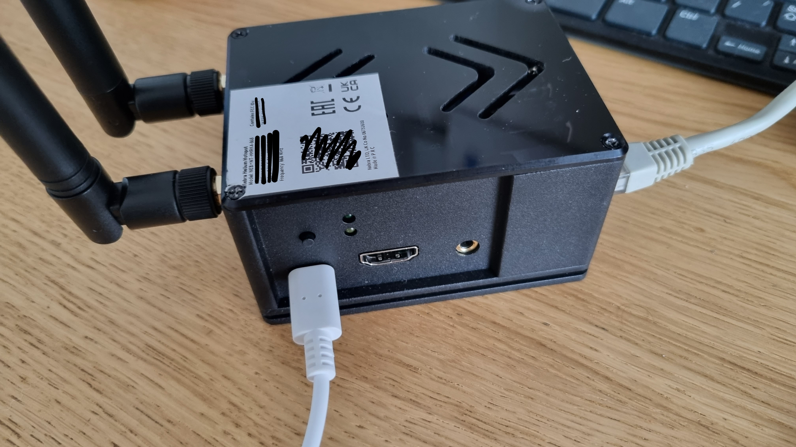

# How to flash your ROCK Pi eMMC with the latest balena OS

This guide will show you how to flash the latest balena OS to your ROCK Pi's eMMC on-board using the software specifically provided by Nebra for your hotspot.

## What you will need

* OS image file specifically for your ROCK Pi hotspot (provided by Nebra)
* microSD card (with SD adaptor) & SD card reader
* Small Philips screwdriver

Do NOT flash your ROCK Pi unless instructed by a member of the Nebra support staff

## Flashing your ROCK Pi

**Step 1** - On your computer download and install Balena Etcher from - https://www.balena.io/etcher/

Once downloaded go ahead and open up Etcher program.

**Step 2** - Click on the **"Flash from File"** button in Etcher and navigate to where you saved your Firmware image file and select it to be installed.

In the middle click **“select target”** to select your SD card to install the OS (It may be selected automatically).

Finally, click on the **"Flash!"** button to begin flashing the OS to your SD card (you may need to type your system password).

**Step 3** - Take your ROCK Pi ensuring that all power has been removed and flip it over to expose 4 screws.

Begin to unscrew the screws and remove the bottom of the unit with the ROCK Pi board. (You may also need to remove the antenna connectors from the ROCK Pi and concentrator)

**Step 4** - Underneath the ROCK Pi board there is a small slot for a microSD card to be inserted into. It must be inserted with the microSD pins facing upwards. Go ahead and insert the microSD card.

**Step 5** - Connect the power adaptor to the Rock Pi USB-C port and allow it to power up.

The Blue LED will start flashing. Once the Blue LED has stopped flashing the flashing of the OS has completed and has now transferred to the eMMC on the ROCK Pi.

Remove the power adaptor from the ROCK Pi and then remove the microSD card.

**Step 6** - Attach the antenna connectors back to the board if you have removed them and then assemble the case back together. It is recommended to slide the case over where the connectors are first at an angle and then the case will fit together.

Screw the screws back into place. Ensure that they are tight but do not overtighten.

**Step 7** - Connect the antennas to the antenna connectors on the case and then connect the Ethernet cable to the ROCK Pi.

**Note: On the first boot the Ethernet cable MUST be connected**

Once connected go ahead and connect the power adaptor to the Hotspot.

**Step 8** - Wait 2 minutes and then begin to pair your hotspot using the Helium application. This will confirm that Bluetooth and Wi-Fi is working as expected.
