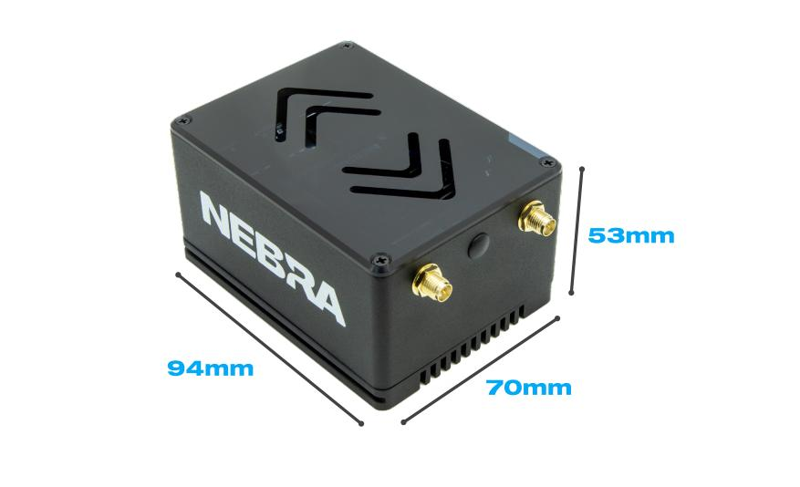
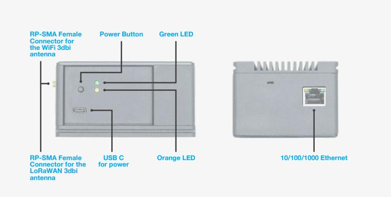

# RockPi Indoor Helium  Hotspot Overview

The Nebra RockPi Indoor Helium Hotspot is a compact & elegant solution to provide Helium LongFi coverage and start mining HNT with ease.

## Quick Specifications

| Specification |RockPi Indoor Hotspot |
| --- | ---  |
| **Dimensions** | 94x70x53 mm (Excluding Antenna) |
| **Weight** | 353g |
| **Power Requirement** | 12V 2.5A USB-C |
| **Maximum TX Power** | 24-27dBm** |
| **Network Connectivity** | 1GBit Ethernet, 2.4/5GHz 802.ac WiFii |
| **Antenna Connection** | RP-SMA Female |
| **Rated Ambient Temperature** | 20-30C |
| **Base SOM** | ROCK Pi RK3399 Processor |
| **CPU Specification** |Dual Core Cortex A72 1.8GHz and Quad Core Cortex A53 1.4GHz |
| **High Endurance Storage** | 32GB |
| **RAM** | 2GB |

###### * Average Power Consumption Measured At Mains,
###### ** Maximum TX Power may be capped to a lower amount in some regions.

## Package Contents

* 1 x Nebra ROCK Pi Miner
* 1 x 3db LoRa Antenna
* 1 x WiFi Antenna
* 1 x Universal Power Supply
* 1 x Ethernet Cable
* 1 x Hotspot $40 On Boarding Fee
* 1 x First $10 Location Assert Fee

*Please note the above image is for illustrative purposes only, colours of some parts may change.*

## Block Diagram

TBA

## Supported Regions

The Nebra Indoor Hotspot comes in three frequency versions:

| Frequency | SKU | 
| --- | ---  |
| **433 Mhz** | NBR-0065 |
| **470 Mhz** | NBR-0066 |
| **868 Mhz** (EU868, IN865, RU864) |  NBR-0063 |
| **915 Mhz** US915, AU915, KR920, AS923-1/2/3/4 | NBR-0064  |

The frequency is set upon initialisation by the Helium Network.

## Antenna Specifications

| Specification | 470Mhz Model | 868 & 915Mhz Models |
| --- | --- | --- |
| **Frequency Range** | 420-480 | 860-930 Mhz|
| **Peak Gain** | 3 dBi | 3 dBi |
| **VSWR** | &lt; 2.3 | &lt; 1.8 |
| **Input Impediance** | 50 Ohms | 50 Ohms |
| **Length** | 17.2CM | 20.7CM  |

## Dimensions

The Nebra Indoor Hotspot is 94x70x53MM In size when nothing is connected.

## Interfaces

#### Connectors

1. **Type C Connector For Power**
2. **Power and Activity LED Indicators.**
3. **Interface Button**
4. **RP-SMA Female Connector for the WiFi 3dbi antenna**
5. **RP-SMA Female Connector for the LoRaWAN 3dbi antenna**
5. **10/100/1000 Ethernet**

## Firmware

The RockPi Indoor Helium Hotspot runs a customizd software to provide high reliability and ensure your units are as up to date as they can be.

Your hotspot will update approximately  once a week in an automatic process, we will announce updates via various social media platforms when they happen.

The software is open source and available on our [Helium Miner Software repo on GitHub](https://github.com/nebraltd/helium-miner-software).

## Unit Information
Each unit has a sticker located on the base of the unit.

IMG NTB

This includes the following important Information:

* **FREQ**: Frequency of the Unit
* **ETH**: Ethernet MAC address
* **NSER**: Nebra Serial Number
* **RPi**: Raspberry Pi Serial Number

You will require some of this information when linking your unit to our [remote management dashboard](https://dashboard.nebra.com).

## Certifications

We are working on getting the Nebra Indoor Hotspot certified in multiple regions. As we have results from the certification process we will post them here.

#### Certification List

| Approval | Countries Covered | Hardware Frequency | Status | Frequency Plans |
| --- | --- | --- | --- | --- |
| CE | European Economic Area | 868 Mhz | [Completed](https://github.com/NebraLtd/Helium-Guides/blob/main/docs/certifications/indoor/rock-pi/CE/EU%20Declaration%20of%20Conformity%20(DoC).pdf) | EU 868 |
| UKCA | United Kingdom | 868 Mhz | [Completed](https://github.com/NebraLtd/Helium-Guides/blob/main/docs/certifications/indoor/rock-pi/UKCA/JYTSZ-R01-2200019%20EN%2055032%2635%20UKCA.pdf) | EU 868 |
| FCC | United States of America | 915 Mhz | [Completed](https://github.com/NebraLtd/Helium-Guides/blob/main/docs/certifications/indoor/rock-pi/CE/EU%20Declaration%20of%20Conformity%20(DoC).pdf) | US 915 |

All certification related documents can be viewed in the [certification folder for our indoor miner](https://helium.nebra.com/certifications/indoor/).

#### FCC Statement

This device complies with Part 15 of the FCC Rules. Operation is subject to the following two conditions:

1. This device may not cause harmful interference.
2. This device must accept any interference received, including interference that may cause undesired operation.

Changes or modifications not expressly approved by the party responsible for compliance could void the user's authority to operate the equipment.

NOTE:
This equipment has been tested and found to comply with the limits for a Class B digital device, pursuant to Part 15 of the FCC Rules.
These limits are designed to provide reasonable protection against harmful interference in a residential installation.
This equipment generates uses and can radiate radio frequency energy and, if not installed and used in accordance with the instructions, may cause harmful interference to radio communications.
However, there is no guarantee that interference will not occur in a particular installation.

If this equipment does cause harmful interference to radio or television reception, which can be determined by turning the equipment off and on, the user is encouraged to try to correct the interference by one or more of the following measures:
* Reorient or relocate the receiving antenna.
* Increase the separation between the equipment and receiver.
* Connect the equipment into an outlet on a circuit different from that to which the receiver is connected.
* Consult the dealer or an experienced radio/TV technician for help.
