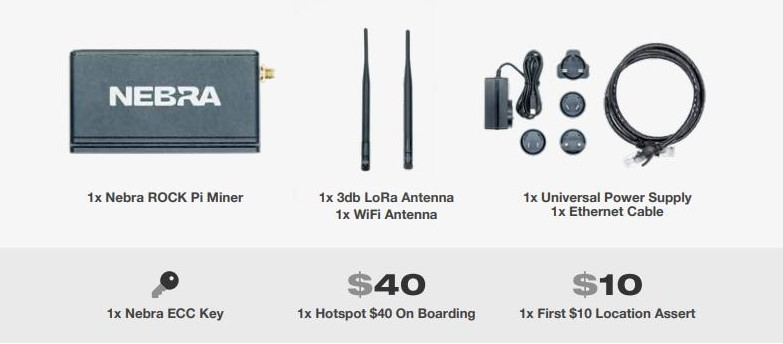
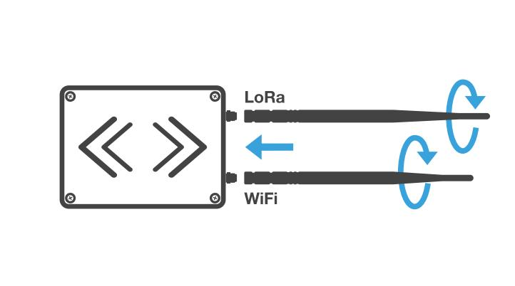
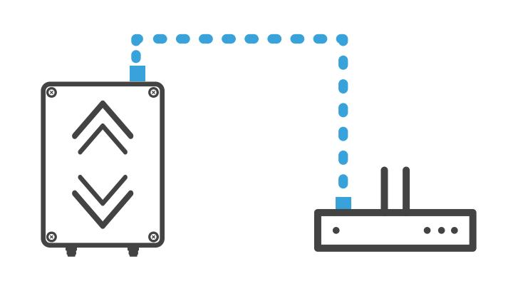
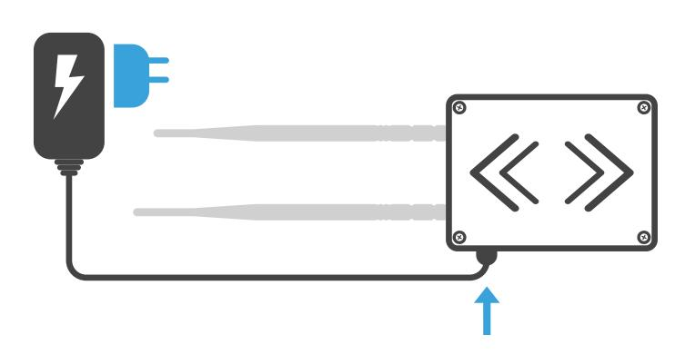
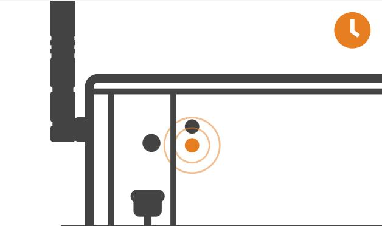
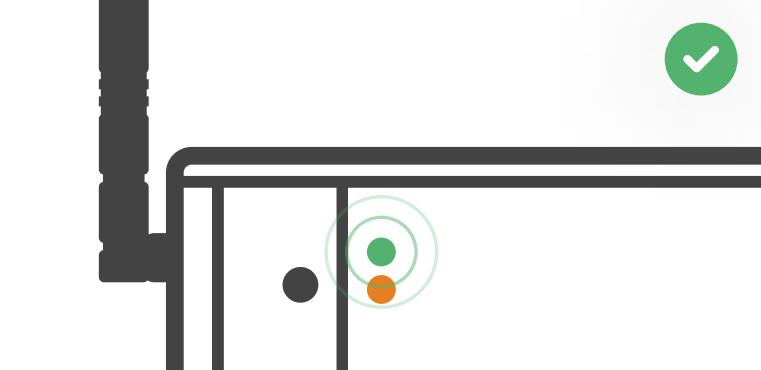

# Indoor Hotspot Quick Start Guide

* [Box Contents](#box-contents)
* [Warnings](#warnings)
* [Preparing Nebra ROCK Pi Indoor Hotspot](#preparing-nebra-rock-pi-indoor-hotspot)
* [Configuring Nebra ROCK Pi Indoor Hotspot](#configuring-nebra-rock-pi-indoor-hotspot)
* [Onboarding Video](#onboarding-video)

## Box Contents
Your Nebra ROKC Pi Indoor Helium Hotspot comes with the following items:

* 1 x Nebra ROCK Pi Miner
* 1 x 3db LoRa Antenna
* 1 x WiFi Antenna
* 1 x Universal Power Supply
* 1 x Ethernet Cable
* 1 x Hotspot $40 On Boarding Fee
* 1 x First $10 Location Assert Fee

*Please note the above image is for illustrative purposes only, colours of some parts may change.*

## Warnings
Please remember to follow these important warnings when using your Nebra ROCK Pi Indoor Hotspot:

* **Never power on the ROCK Pi Indoor hotspot without it's antenna connected as this may damage the unit.**
* Do not place in direct sunlight or on hot surfaces (e.g a heater).
* The Indoor unit's case is designed to be used indoors, and is not suitable for use outdoor usage.

**Note:** If you want place your miner outside, please consider our IP67 rated weatherproof [outdoor hotspot miner](https://www.nebra.com/products/helium-outdoor-hotspot-miner-gateway).

## Preparing Nebra ROCK Pi Indoor Hotspot

**Step 1:** First screw in the included antenna into the connector on the back of the hotspot.

If you are using wired connection, plug an ethernet cable in between a router and the ethernet port on the hotspot. 

**Step 2:** Next find a suitable location for your Hotspot to be positioned, to provide the best coverage we recommend placing it near a window just out of direct sunlight. You’ll need to be near a mains power source too.

> Please check "[Ideal Hotspot Placement](../handy-guides/hotspot-ideal-location.md)" Guide 

**Step 3:** Assemble the appropriate adapter for country onto the universal power supply, plug into mains power and insert power cable into the hotspot. 

**Step 5:** When the hotspot is powered up, the lower orange LED will be on. It will take up to 5 minutes to configure after the first boot. 

This process may take slightly longer as it’ll also perform firmware updates as soon as it gets a connection to the internet. Once it's done you can see the Green light led is turned on. 

## Configuring Nebra ROCK Pi Indoor Hotspot

To configure your Hotspot, you will require the Helium Network application installed on a Mobile Phone, and for you to have gone through the account setup process to continue.

> For the best results, Nebra Hotspots require some ports to be port forwarded on your network. Please check our [security](../security.md) and [port forwarding](../handy-guides/port-forwarding/overview.md) pages for more details.

**Prerequisites**

* Ready to connect nebra hotspot 
* Helium application with account. 

**Step 1:** Open the Helium application and login, then press **+ Add a Hotspot**.

**Step 2:** Next click Set up Hotspot, from here you will want to select Nebra Indoor Hotspot.

<!--  -->

**Step 3:** Place your hotspot in appropriate location, please reffer [Ideal Hotspot Placement](../docs/handy-guides/hotspot-ideal-location.md)

**Step 4:** Accept diagnostics permission , This will allow **Nebra Ltd** to identify issues with your Hotspot in a secure way

**Step 5:** Power Up the Nebra hotspot, and please note that never power on the Indoor/Outdoor hotspot without it's antenna connected as this may damage the unit.

**Step 6:** Turn on mobile phone bluetooth  and Push the button on the back of the unit once to enable pairing

<!--  -->

**Step 7:** Select your hotspot in the app, you can check it is the correct one by matching the last 6 characters shown in the application with the last 6 characters of the mac address printed on the sticker on the bottom of the hotspot.

<!--  -->

**Step 8:** The app will show the available Wi-Fi networks within range of your Hotspot.

**Step 9:** Once you provide the WiFi details, it will take few minutes to complete the connection

> **If you are using Ethernet,** tap Use Ethernet Instead and skip to Step 10.

> **If using Wi-Fi,** tap on the name of your Wi-Fi network on the app which will bring you to the following screen.

**Step 10:** Next you need to submit antenna height and power details. 

**Step 11:** Provide location permission: The helium application use phone location to assert location to the device.  

**Step 12:** Finally, you can confirm the location of your hotspot. Click continue and you should be presented with a map to then place where your hotspot is on the app. This requires $10 and it's alredy paid by Nebra LTD.

**Step 13:** The setup should now be complete, it'll submit the details of the Hotspot to the Helium network and then in approximately 15 minutes confirm it's added to the network.

You can move device to another location, However every time you move your hotspot to a new location you will need to pay the $10 location assert fee again.

## Onboarding Video

You can also watch this video to learn how to onboard the hotspot. This is using the Nebra Indoor Hotspot on Android, but the process is very similar for the Outdoor Hotspot and using iOS devices:

<iframe width="560" height="560" src="https://www.youtube.com/embed/6pSKwtGAwDg" title="YouTube video player" frameborder="0" allow="accelerometer; autoplay; clipboard-write; encrypted-media; gyroscope; picture-in-picture" allowfullscreen></iframe>
