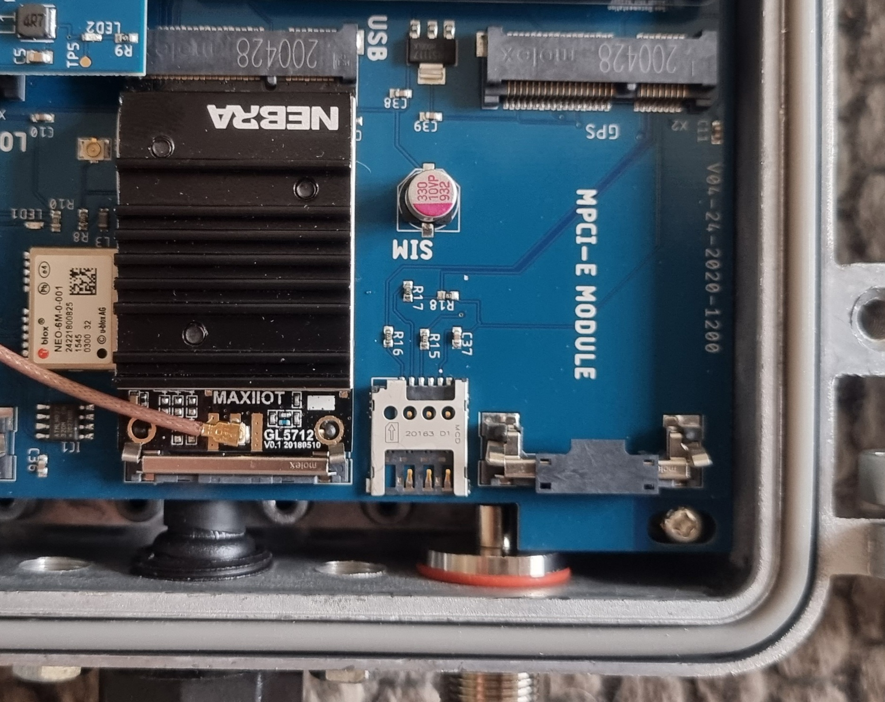
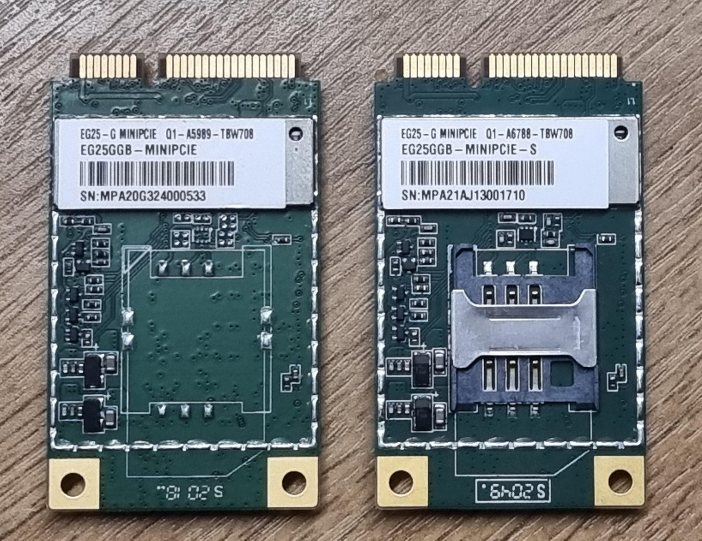
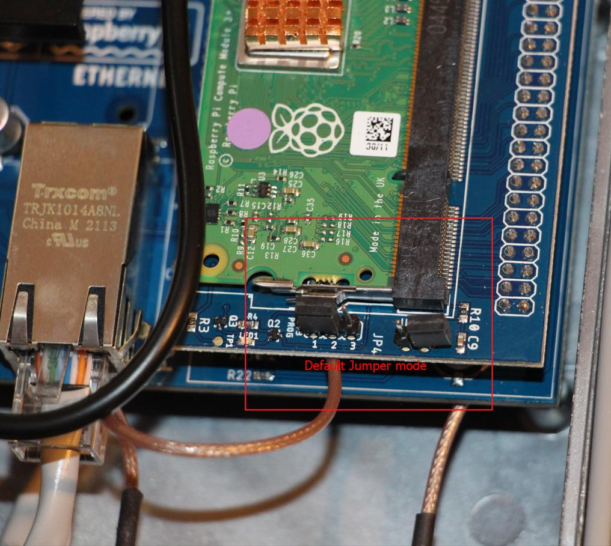

# Adding a 4G / LTE Modem to your Outdoor Hotspot

## 4G Module Installation Overview

This tutorial will walk you through installing and configuring a 4G / LTE modem. Other modems may work (such as 3G, 5G & NB-IOT) and over time we may test and add official support for more models. 

Our hotspots run on balenaOS operating system (which is based on Yocto Linux). BalenaOS uses NetworkManager to manage networking and ModemManager to manage cellular modems, so any USB based mPCIe format cellular modem that is supported by Linux Kernel drivers as well as by ModemManager should work fine, but we are not able to test every permutation. 

Our recommended modem is the [Quectel EG25-G package](https://www.nebra.com/products/quectel-eg25-g-mini-pcie-with-antennas) that we sell on our website.

## Required Hardware

* 4G Module*
* 2 x 4G Antenna*
* 2 x N Type to U.FL Bulkhead*
* micro SIM card with ~50GB per month data package

\* If you order our [Quectel EG25-G package](https://www.nebra.com/products/quectel-eg25-g-mini-pcie-with-antennas) this includes all of these items.

## Tested 4G mPCIe Modules

This is a list of 3G/4G mPCIe modules that we've validated work with the balenaOS / NetworkManager / ModemManager software stack used on Nebra Helium Hotspots.

All were tested in the UK. Please note however that **only the Quectel EG25-G mPCIe module has been tested in our compliance testing** and therefore if you want to use any other module you may need to undergo further compliance testing with the alternative module...the testing below is **functional only**.

| Module | Status | Sim Card | USB ID | Notes |
| --- | --- | --- |  --- | --- |
| Quectel EG21-G | Pass | Micro SIM on Nebra Outdoor | 2c7c:0121 | |
| Quectel EG25-G | Pass | Micro SIM on Nebra Outdoor | 2c7c:0125 | |
| Quectel EC25-E | Pass | Micro SIM on Nebra Outdoor | 2c7c:0125 | |
| Quectel EG25-G SIM | Pass | Standard size SIM on module or Micro SIM on Nebra Outdoor | 2c7c:0125 | |
| SimCom SIM7100E | Pass |  Micro SIM on Nebra Outdoor | 1e0e:9001 | |
| Telit LE910C4-EU SIM | Pass* | Standard size SIM on module or Micro SIM on Nebra Outdoor | | \*Pass based on same module used in the Reyax |
| Telit LE910C4-EU | Pass* | Micro SIM on Nebra Outdoor | | \*Pass based on same module used in the Reyax |
| Reyax RYT9000 | Pass | Nano SIM on module or Micro SIM on Nebra Outdoor | 1bc7:1201 | Based on the Telit LE910C4 chipset |
| Sierra Wireless MC7700 | Needs Testing | Micro SIM on Nebra Outdoor | 1199:68a2 | No longer manufactured |
| Huawei ME909s-120 | Needs Testing | Micro SIM on Nebra Outdoor | 12d1:15c1 | No longer manufactured |
| MikroTik R11e-LTE6 | Needs Testing | Micro SIM on Nebra Outdoor | 2cd2:0004 |  |

> Have you tested an mPCIe cellular modem with your Nebra Outdoor Hotspot and want us to add it to the list? Or have a modem that is not on this list which you would like to ensure is supported? Please post an issue on our [GitHub Issues section](https://github.com/NebraLtd/Helium-Guides/issues/new).

## Onboard or offboard SIM card?

You will notice that on our outdoor hotspot main board, between the mPCIe module slot and the LoRa module, there is a holder for a Micro SIM card. This is directly wired to the external SIM card pins for the mPCIe module such that a Micro SIM card inserted in this slot works seamlessly with the modem.



However in the table above you can see that some of the modems listed have both an onboard SIM card slot on the module itself as well as the Micro SIM slot on the outdoor hotspot main board. You can see an example of this in the below photo, which shows the Quectel EG25-G (no SIM slot) and EG25-G-S (with SIM slot) mPCIe modules, both of which we supply like-for-like as part of our [Quectel EG25-G package](https://www.nebra.com/products/quectel-eg25-g-mini-pcie-with-antennas):



For modems without an onboard SIM slot, you will obviously need to use the Micro SIM slot on the Nebra Outdoor Hotspot itself. For the modems that have a SIM slot on the modem itself, typically these modules will support having your SIM card placed either directly in the module or in the Nebra SIM slot. However, if you find that the modem is not working correctly then we would highly recommend trying the other slot as it might be that your specific modem is not wired up in a conventional way (especially if it is not featured on the above list or marked as not tested). One final thing to note is that for modules that have on board SIM card holders these are sometimes not the same size as the Micro SIM on our outdoor hotspot but instead may use a standard or nano sized SIM card so you must make sure to get the correct size SIM for your application.

## Installing the 4G Module & Sim Card


## Adding your APN details using the diagnostics page

In the future, you will be able to do the initial configuration of the APN settings for your modem from the local diagnostics page on our miners whilst they are connected over WiFi or Ethernet. However we have not yet implemented this feature. So for the time being you will need to use the manual setup below.

## Manually adding the APN details

In order to manually add your APN connection details you will need to plug your Nebra Outdoor Hotspot into another computer with a text editor. Any Windows, macOS or Linux machine with USB connectivity should be fine.

First, you will need to adjust some pin jumpers on the "daughterboard". The daughterboard is the highest of the blue circuit boards in the case, and has the green Raspberry Pi compute module attached to it. As you can see circled in the image below, there are two jumpers labeled JP3 and JP4:



JP3 is the 2 pin jumper at the bottom of the circled area and JP4 is the 3 pin jumper at the top of the circled area. When you get your miner, JP3 should be covering just one of the two pins and JP4 should be on the pins labelled 1 and 2. In order to program the compute module, you need to move the jumper JP3 so that it covers both of the two pins and you will need to move the jumper for JP4 onto the pins labeled 2 and 3. When done it should look like this:


Then you can remove the short microUSB cable from between the WiFi/Bluetooth dongle board and the main board (you can see it indicated with an arrow below):


You can then proceed to removing the USB hub board altogether:


Next, you can plug a microUSB cable into the microUSB connector on the daughterboard (please be **very careful** during this step so that you do not damage the connector):

pic

Plug the other end of the microUSB cable into your computer and it should recognise the compute module as a mass storage device. In your file browser you should be able to now find a device / volume called `resin-boot`:

pic

You will then need to open a plain text editor on your computer (something like Notepad on Windows or TextEdit on macOS) and copy the following settings into a blank file:

```
[connection]
id=cellular
type=gsm
autoconnect=true

[gsm]
apn=giffgaff.com
number=*99#
password=password
username=giffgaff

[serial]
baud=115200

[ipv4]
method=auto

[ipv6]
addr-gen-mode=stable-privacy
method=auto
```

Alternatively you can download the file by right clicking [this link](https://raw.githubusercontent.com/NebraLtd/Helium-Guides/main/docs/outdoor-hotspot/cellular) and clicking save as and saving the file with filename `cellular`. You will need to substitute the settings for `apn`, `number`, `password` and `username` for those that correspond to your network provider. We do maintain a [list of known APNs](https://github.com/NebraLtd/Helium-Guides/blob/main/docs/outdoor-hotspot/lte-apns.md) on the website however it is not complete. If you can't find your provider usually Googling for `apn settings for xx network` for your network (where `xx` is the network name) should pull up some useful results. If you find working APN details and they are not already included in the tables on the APN page then we would be very grateful if you could please post an issue on our [GitHub Issues section](https://github.com/NebraLtd/Helium-Guides/issues/new) with the details so we can add them.

Once you have updated the settings in the file, make sure to save the file somewhere that you will remember with the file name `cellular` (no file extension like .txt should be used). Browse to the location of this file, right click on it and click copy. Then browse back to the `resin-boot` device we found earlier, navigate to the `system-connections` folder and paste the file here (you should also see some files already there called ???). You can then eject the mass storage device from your computer and then remove the USB cable.

Last but not least, you will need to re-assemble the hotspot as it was when we started, and return the pin jumpers JP3 and JP4 back to their original positions:

JP3 - covering just one of the two pins (it doesn't matter which one)
JP4 - accross pins 1 and 2

You can now boot up your hotspot as normal and it should get a cellular connection. We would highly recommend verifying you have a good connection before sealing the case so you do not have to continually keep having to open and close the case.
