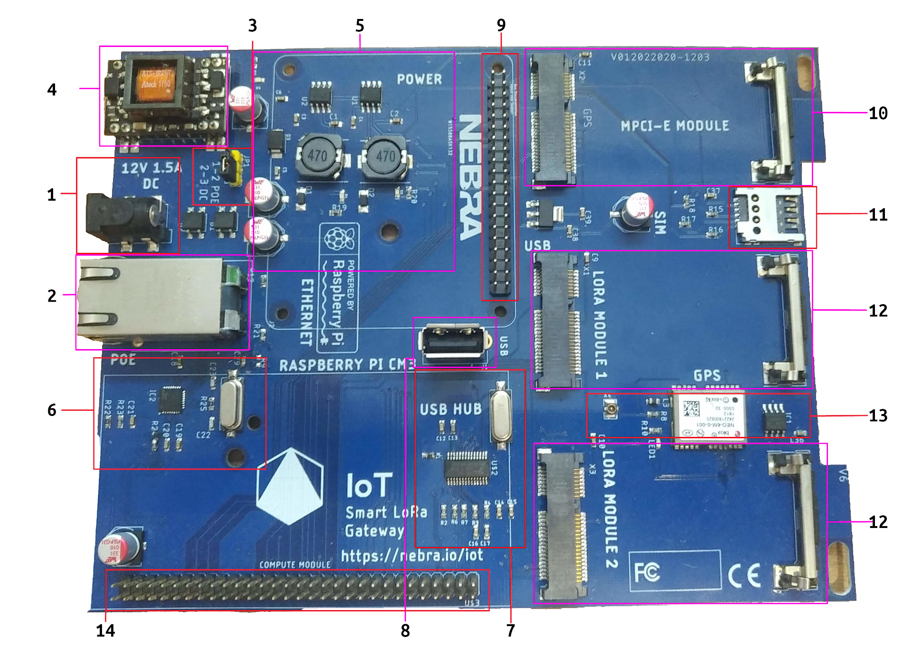
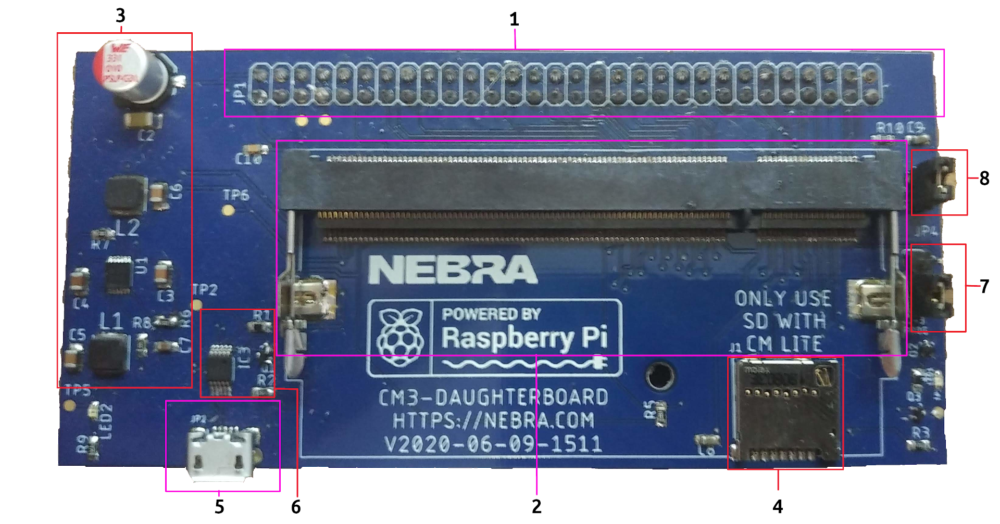

# Outdoor Helium Hotspot Overview

The Nebra Outdoor Helium Hotspot is an ideal solution for providing great Helium LongFi coverage and suitable for use outside in most envrionments.

## Specifications

| Specification | Nebra Outdoor Hotspot |
| --- | ---  |
| **RRP** | £450 ex VAT |
| **Ingress Protection** | IP67 |
| **Dimensions** | 300x200x100 mm (Excluding Antenna) |
| **Weight** | 1.25 Kg |
| **Power Requirement** | 802.3AF 48V POE *OR* 9-16V DC @ 15W |
| **Average Power Consumption** | ~12-15W* |
| **Annual Power Consumption** | ~105-130kWh |
| **Maximum TX Power** | 24-27dBm** |
| **Network Connectivity** | 10/100 Ethernet, 2.4Ghz 802.11N Wi-Fi, Optional 4G Module available separately.|
| **Antenna Connection** | N Type Female |
| **Base SOM** | Raspberry Pi CM3+ |
| **CPU Specification** | Broadcom BCM2837B0, Quad Core Cortex-A53 (ARMv8) 64-bit SoC @ 1.2GHz |
| **High Endurance Storage** | 32GB |
| **RAM** | 1GB LPDDR2 SDRAM |

###### * Average Power Consumption Measured At Mains, higher average consumption when the optional 4G Module is used.
###### ** Maximum TX Power may be capped to a lower amount in some regions.

## Package Contents

1. **3 dBi N-Type Glass Fiber Antenna**
2. **WiFi Antenna** 
3. **Nebra Helium Outdoor Hotspot**
4. **M20 General Cable Gland**
6. **M10 General Cable Gland**
5. **M22 General Cable Gland**
7. **Sealing String**
8. **Spare Blanking Plugs N-type**
9. **Spare Blanking Plugs N-type**
10. **Spare Blanking Plugs M20**
11. **L Shaped Mounting Brackets 2 x L**
12. **Z clamp Brackets x 2** (for pole mounting)
13. **Serial Number QR Code Stickers x 2**
14. **Nebra Stickers x 2**

## Block Diagram

## Supported Regions

The Nebra Outdoor Hotspot comes in three hardware versions:

| Frequency | Supported Regions |
| --- | ---  |
| **433 Mhz** | Coming Soon |
| **470 Mhz** | CN470 |
| **868 Mhz** | EU868, IN865, RU864 |
| **915 Mhz** | US915, AU915, AS923-1/2/3/4, KR920 |

The frequency is set upon initialisation by the Helium Network.

## Antenna Specifications

| Specification | 470Mhz Model | 868 & 915Mhz Models |
| --- | --- | --- |
| **Frequency Range** | 420-480 | 860-930 Mhz|
| **Peak Gain** | 3 dBi | 3 dBi |
| **VSWR** | ≤1.5 | ≤1.5 |
| **Input Impediance** | 50 Ohms | 50 Ohms |
| **Length** | 50CM | 30CM |

## Hardware Overview

### Mainboard Layout

##### Layout Contents

1. DC Barrel Jack - 2MM Pin, 6.5MM Barrel centre positive. Recommended PSU 12V @1.5A.
2. LAN Connector - RJ45 Connector wired to the Ethernet & POE Modules.
3. Power Jumper - 3 Pin jumper to select power source, place in position 1-2 for POE, or 2-3 for DC Jack.
4. POE Module - Negotiates 802.11AF compliant connection and outputs 12V DC into the power section.
5. Power Section - Takes the 12V power source and regulates it down to 5V & 3V3 rails.
6. Ethernet Controller - 10/100 Ethernet to USB 2.0 Adaptor, Maxlinear XR22800IL32-F. Connected to USB Hub.
7. USB Hub - 4 Port USB Hub, wired to Ethernet controller, USB port & M-PCIE connector.
8. USB Port - USB 2.0 Type A Connector, recommended max power 250mA.
9. "Raspberry Pi" Header - 40 Pin RPi style header, please note only the first 24 pins are wired. (Refer to 1.1.X)
10. M-PCIE connector - M-PCIE Connector wired up to USB for connectivity, has Micro SIM Card connected to it.
11. Micro Sim Card Slot - For use with 3G/4G Module in M-PCIE slot
12. Lora Module Connector - Designed for use with select M-PCIE LoRa Concentrators, these only have wired up SPI, plus GPS PPS from the GPS Module.
13. GPS Module - NEO-6M GPS module, connected to UART1 on the compute module. Plus PPS signal to LoRa modules for accurate timings. **PLEASE NOTE: this is not used by the Nebra Helium Hotspots and is only present on the first batch.**
14. Daughterboard Connector - Connects to Compute Module Daughterboard.

#####  Status LEDS
The mainboard has 3 Status LEDs which do the following:
* 12V LED - Indicates the mainboard has power located near the jumper.
* 5V LED - Indicates the 5V regulator is operational located in the power section.
* 3V3 LED - Indicates the 3V3 regulator is operational located in the power section.

####  Daughterboard Overview
The standard daughterboard supports both the Compute Module 3 and Compute Module 3+ (including Lite) variants.

While also compatible with the CM1 we recommend using the CM3 / CM3+ / CM3 Lite / CM3+ Lite for the extra power and RAM as well as larger onboard storage options.

##### Layout Contents
1. Daughterboard Connector - Connects to the Mainboard.
2. SO-DIMM connector - Raspberry Pi Compute Module connects here.
3. Power Regulator - Power Circuitry required for the compute module.
4. SD Card Slot - SD Card Slot for if a CM3/CM3+ Lite is used.
5. Micro USB Connector - Used to re-flash the EMMC on the Compute Module.
6. USB Switch - IC responsible to allow switching between Micro USB and Mainboard.
7. USB Jumper - Used to switch between normal operation and flash mode, ensure it is in position 1-2 for normal operation and 2-3 for programming.
8. Power Jumper - Allows the module to be powered from the Micro USB connector. Only connect when programming from PC and ensure mainboard is not connected.

##### Status LEDS
The board has 2 Status LEDs which do the following:
* Power LED - Indicates the board has power. (Blue)
* ACT LED - Indicates Read / Write operations on the storage. (Green)

## Dimensions

The Nebra Outdoor Hotspot is approximately 300x200x100 mm In size when nothing is connected.

## Interfaces

#### Connectors

##### From the outside

<Image>

1. CAT 5e Gland / Passthrough Gland
2. N-Type Female LoRa Antenna Connector

#### On the inside

<Image>

1. 9-16V @ 15W DC 6.5MMx2.0MM Barrel Jack
2. Ethernet Connector
3. LED Indicator.
4. Interface Button
5. 4G / LTE Module Connector
5. Sim Card Slot

#### Status Indicator

The Nebra Outdoor Hotspot has a status indicator called LED1 on the Wifi daughterboard in the middle of the hotspot

This indicator is RED and will act accordingly:

* Off - Software has not started yet.
* On - Operating as normal
* Slow Blinking - Bluetooth Pairing is enabled
* Fast Blinking - There is potentially a fault. Please check diagnostics page.

#### Button

The Nebra Outdoor Hotspot has a button on the Wifi daughterboard in the middle of inside teh hotspot. This is labeled S1

This is used to re-enable bluetooth pairing on the hotspot, hold the button in for approximately 15 seconds then release to start pairing. The adjacent status light LED1 should start blinking slowly if successful.

## Firmware

The Nebra Hotspots run a customised software to provide high reliability and ensure your units are as up to date as they can be.

Approximately your hotspot will update once a week in an automatic process, we will announce updates via various social media platforms when they happen.

The software is open source at https://github.com/nebraltd/helium-miner-software

## Certifications

We are working on getting the Nebra Outdoor Hotspot certified in multiple regions.

#### Certification List

| Approval | Countries Covered | Hardware Frequency | Status | Frequency Plans |
| --- | --- | --- | --- | --- |
| CE | European Economic Area | 868 Mhz | In Progress | EU 868 |
| UKCA | United Kingdom | 868 Mhz | In Progress | EU 868 |
| FCC | United States of America | 915 Mhz | [Completed](https://helium.nebra.com/certifications/outdoor/FCC/P21SZ07107%20FCC%20ID%202AZDM-HNTOUT-JAD.pdf) | US 915 |
| ISED | Canada | 915 Mhz | In Progress | US 915 |
| RCM | Australia & New Zealand | 915 Mhz | In Progress | AU 915 |
| MIC | Japan | 915 Mhz | In Progress | AS920 (AS1) |
| SRRC | China | 470 Mhz | In Progress | CN 470 |
| EAC  | Russia | 868 Mhz | In Progress | RU 864 |
| WPC | India | 868 Mhz | In Progress | IN 865 |

All certification related documents can be viewed in the [certification folder for our outdoor miner](https://helium.nebra.com/certifications/outdoor/).

#### Certification Codes

| Certification | ID Code |
| --- | ---  |
| FCC | 2AZDM-HNTOUT |
| ISED | 27187-HNTOUT |

#### FCC Statement

This device complies with Part 15 of the FCC Rules. Operation is subject to the following two conditions:

1. This device may not cause harmful interference.
2. This device must accept any interference received, including interference that may cause undesired operation.

Changes or modifications not expressly approved by the party responsible for compliance could void the user's authority to operate the equipment.

NOTE:
This equipment has been tested and found to comply with the limits for a Class B digital device, pursuant to Part 15 of the FCC Rules.
These limits are designed to provide reasonable protection against harmful interference in a residential installation.
This equipment generates uses and can radiate radio frequency energy and, if not installed and used in accordance with the instructions, may cause harmful interference to radio communications.
However, there is no guarantee that interference will not occur in a particular installation.

If this equipment does cause harmful interference to radio or television reception, which can be determined by turning the equipment off and on, the user is encouraged to try to correct the interference by one or more of the following measures:
* Reorient or relocate the receiving antenna.
* Increase the separation between the equipment and receiver.
* Connect the equipment into an outlet on a circuit different from that to which the receiver is connected.
* Consult the dealer or an experienced radio/TV technician for help.

#### Resources

You can find 2D and 3D drawings of the outdoor IP67 case here 

* [Outdoor IP67 Case Diagram](../datasheets/cases/outdoor/IP67-Diagram-DAM005C.pdf ':ignore')
* [Outdoor IP67 Case Drawing](../datasheets/cases/outdoor/IP67-Diagram.dwg ':ignore')
* [Outdoor IP67 3D Model Top](.../datasheets/cases/outdoor/IP67-3D-Model-DAM005CLID.stp ':ignore')
* [Outdoor IP67 3D Model Bottom](../datasheets/cases/outdoor/IP67-3D-Model-DAM-005CBOTTOM.stp ':ignore')

Click [here](../datasheets/cases/outdoor/IP67-Diagram.zip ':ignore') to download all the files.

