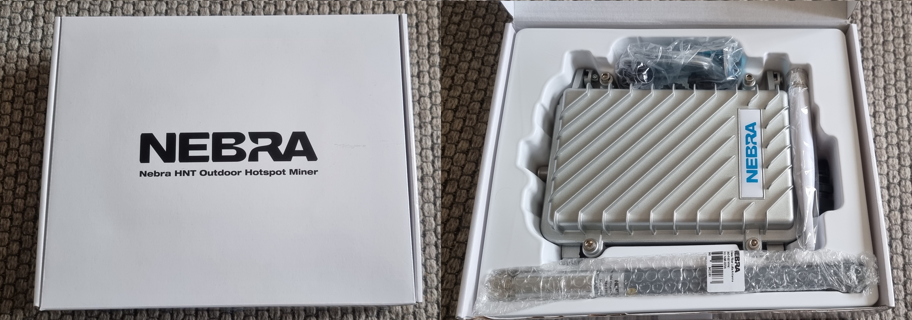
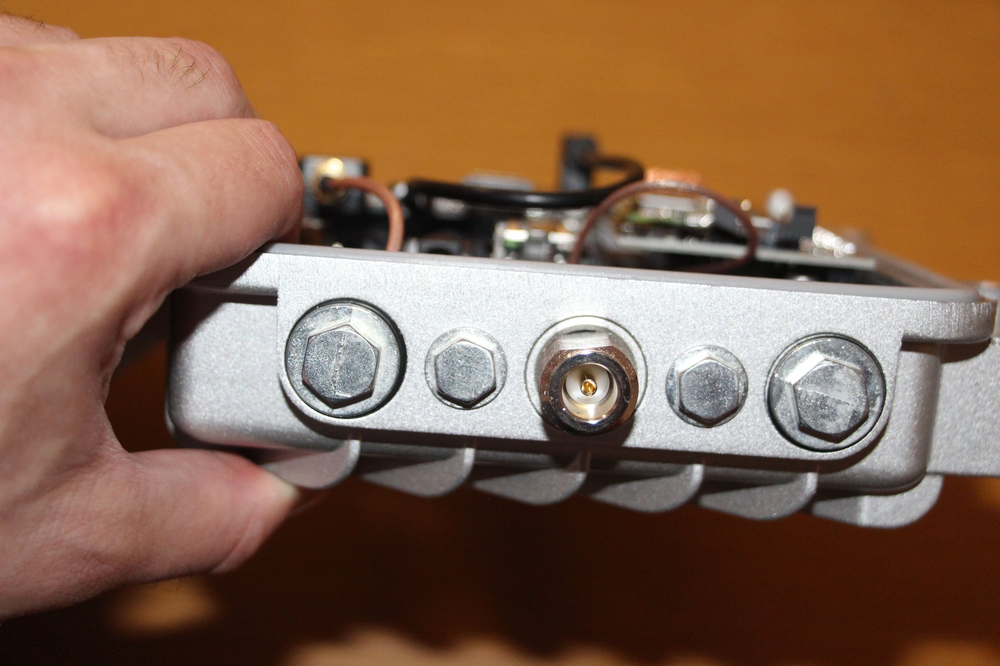
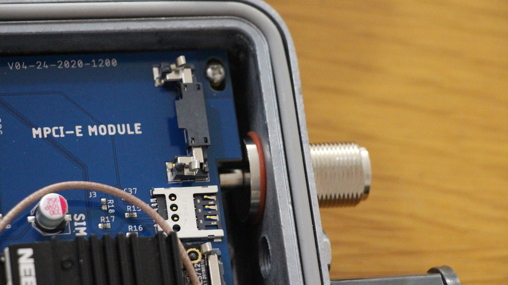
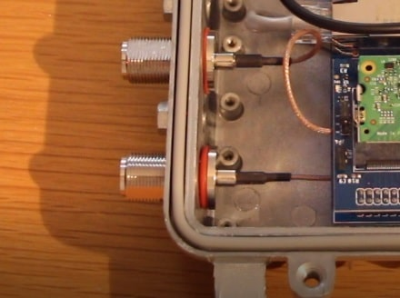
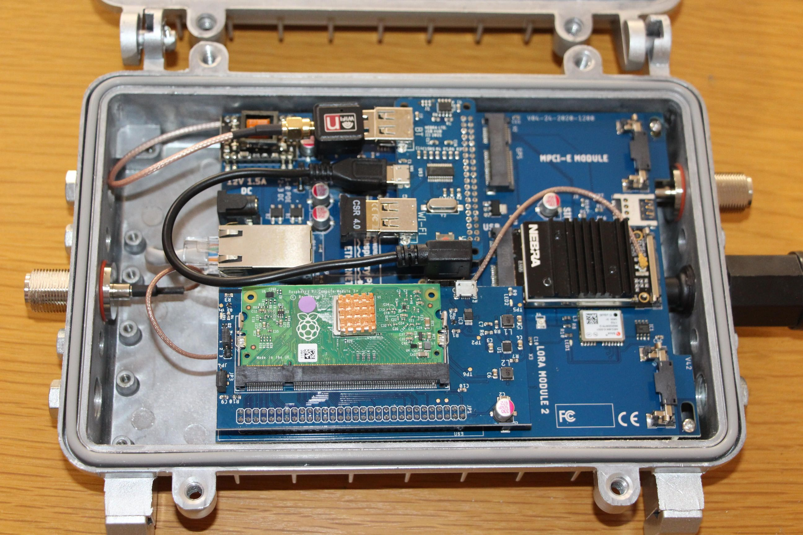
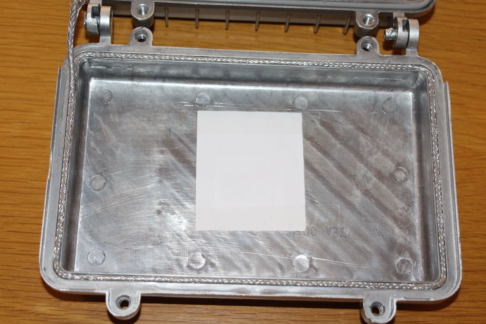
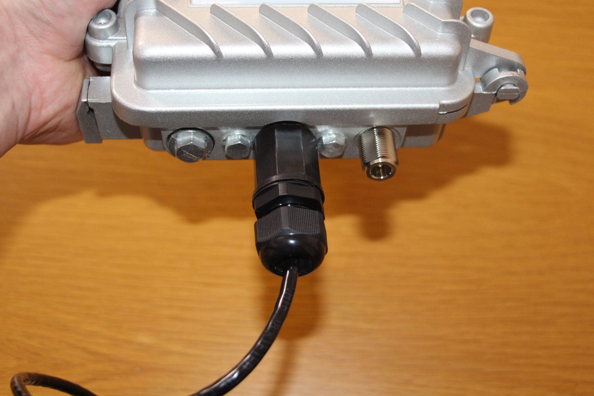
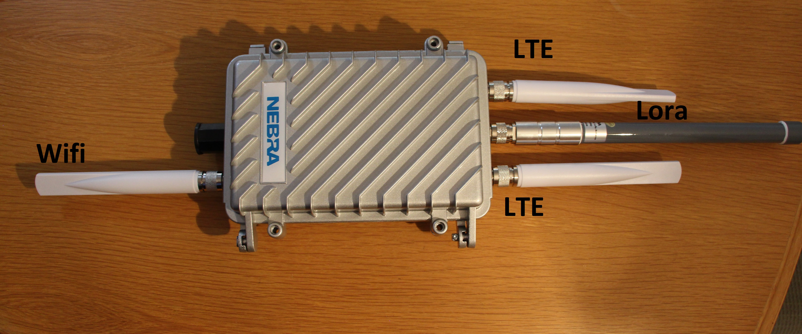

# Outdoor Hotspot Quick Start Guide

## Box Contents
Your Nebra Outdoor Helium Hotspot comes with the following items:

* The Nebra Helium Outdoor Hotspot
* 3 dBi N-Type glass fiber antenna
* N-type WiFi antenna
* Ethernet gland cover end
* Sealing string
* M20 general cable gland
* M10 general cable gland
* Spare blanking plugs (2 x N-type, 1 x M20)
* 2 x L shaped mounting brackets
* 2 pairs of Z clamp brackets (for pole mounting)
* 2 x serial number QR code stickers
* 2 x Nebra stickers

*Please note: You will need a Power Over Ethernet power source (802.3af/802.3at PoE switch or PoE injector) in order to power the outdoor hotspot. Alternatively, you can use a 12 Volt / 1.5 Amp power supply which can be [purchased separately on our website](https://www.nebra.com/products/nebra-12-volt-1-5-amp-worldwide-power-supply).*

## Warnings

Please remember to follow these important warnings when using your Nebra Outdoor Hotspot:

* **Never power on the Outdoor hotspot without the grey LoRa antenna connected as this may damage the unit.**
* The Outdoor unit's case is designed to be used outdoors, in all weather conditions, however it is always recommended to protect it from the elements whenever possible especially in harsh environments. Additionally, the outdoor case is not suitable for submerged usage.
* Before installing outside, make sure you have tightened all connectors and the case itself very well to avoid any unintended water ingress.
* The unit should operate without issue even in direct sunlight - however, heat cycling can reduce the service life of the electronics. So where possible it is always recommended to provide some shade for the hotspot case itself.
* It is highly reccommended to provide surge protection both on the antenna connection (to avoid damage to the LoRa concentrator) and on the Ethernet connection (to avoid any onwards damage to your networking equipment in the event of a lightning strike or similar. Please read our [surge protectors](../handy-guides/surge-protectors.md) guide for more information.
* Before placing your hotspot outside, you need to make sure that it is fully waterproof. You can find more info about this down below.
  

**Note:** If you want place your outdoor miner inside, that is entirely fine and will work without issue, however you may want to consider our [indoor hotspot miner](https://www.nebra.com/products/helium-indoor-hotspot-miner) instead.

### Preparing Your Nebra Outdoor Hotspot

**Step 1:** First, carefully screw in the included LoRaWAN antenna (the large, cylindrical antenna, usually grey), to the port at the top of the hotspot. 

You may also have a smaller WiFi antenna (white), that screws into the connection at the bottom of the hotspot, beside the ethernet gland.

**Step 2:** Next find a suitable location for your hotspot to be positioned, to provide the best coverage we recommend placing it on a rooftop, or mast as high as possible. 

Please take all appropriate precautions if working at height, or ask a trained professional to install the hotspot if you are unsure. 

**Step 3:**  You will need to consider how to power the hotspot. By default, it is configured for Power over Ethernet (PoE -  IEEE 802.3af or  IEEE 802.3at), using a switch or PoE injector. 

To power using a DC supply, you may need to open the case to change a jumper clip. (coming soon)

**Step 4:**  Use an ethernet cable connected to your PoE switch or PoE injector, and connect it to the hotspot using an ethernet cable to with the supplied gland, to ensure a watertight (IP68) seal. 

It takes a minute or so to power on, and for the first 10 minutes, the hotspot is discoverable via Bluetooth. 

note: even if you have powered the hotspot using PoE, but there is no network connection, WiFI will still work as usual. 

If you have connected it to a wired Ethernet connection, the process may take slightly longer as it’ll also perform firmware updates as soon as it gets a connection to the internet.

**Step 5:** register your hotspot (see below) and wait for your hotspot to sync the blockchain, this can take a few hours. 

## Ensure waterproofing

Before placing your hotspot outside you need to check a few parts to ensure the waterproofing

**Step 1** Check the bolts

You should make sure that all bolts are tight. Control all bolts at the top and the bottom manually. The medium sized bolts should have rubber gaskets on them. The small ones don't have a gasket.

**Step 2** Check the antenna connectors

Make sure that all antenna connectors are fully screwed in. They need to sit tight and the gasket should be squished. They should look as following:

If they look as following, you should tighten them further:

**Step 3** Check the gasket of the bottom cover

You need to make sure that the gasket for the bottom cover is properly seated and not damaged

**Step 4** Install the sealing string on the top cover

The seal for the top cover is not inserted when you receive the hotspot. You need to push the sealing string into the top lid and cut it to the correct length needed. The ends should connect at the bottom of the hotspot.

**Step 5** Install the Ethernet gland

Make sure that the Ethernet gland is properly sealed with the fitting connector.

**Step 6** Tighten the bolts of the casing

After closing the lid of your hotspot you need to make sure that the cover is properly closed. Check all 4 screws and tighten them fully to ensure the waterproofing

## Antenna placements

The Lora antenna is connected on the pre-installed antenna connector on top of the hotspot in the center. 
The Wifi antenna is attached on the pre-installed antenna connector at the bottom of the hotspot.

The LTE antennas are not included with the Outdoor hotspot and need to be purchased seperately. They are delivered with the Quectel LTE modem when you order from us. The antenn connectors should be placed at the top of the hotspot on the left and right side.

All antenna connectors are N-type female.

## Configuring Your Nebra Outdoor Hotspot

To configure your Hotspot you will require the Helium Network application installed on a Mobile Phone and for you to have gone through the account setup process to continue.

**Step 1:** Open the Helium application and login, then press hotspots.

**Step 2:** Next click Set up Hotspot , from here you will want to select Nebra Outdoor Hotspot.

**Step 3:** After following the steps on the App to get to this page, Push the button on the back of the unit once to enable pairing and then press scan on the App.

**Step 5:** Press the entry for your hotspot in the app, you can check it is the correct one by matching the last 6 characters shown in the application with the last 6 characters of the mac address printed on the sticker on the bottom of the hotspot.

**Step 6:** The app will show the available Wi-Fi networks within range of your Hotspot.

**If you are using Ethernet,** tap Use Ethernet Instead and skip to Step 7.

**If using Wi-Fi,** tap on the name of your Wi-Fi network on the app which will bring you to the following screen.

Type in your Wi-Fi's network password then tap Connect and it should connect to your wi-fi network.

**Step 7:** The app will then ask for you to set your hotspot's location.

**Step 8:** Finally you can confirm the location of your hotspot. Click continue and you should be presented with a map to then place where your hotspot is on the app.

**Step 9:** The setup should now be complete, it'll submit the details of the Hotspot to the Helium network and then within 15 minutes confirm it's added to the network.

## Onboarding Video

You can also watch this video to learn how to onboard the hotspot. This is using the Nebra Indoor Hotspot on Android, but the process is very similar for the Outdoor Hotspot and using iOS devices:

<iframe width="560" height="560" src="https://www.youtube.com/embed/6pSKwtGAwDg" title="YouTube video player" frameborder="0" allow="accelerometer; autoplay; clipboard-write; encrypted-media; gyroscope; picture-in-picture" allowfullscreen></iframe>
